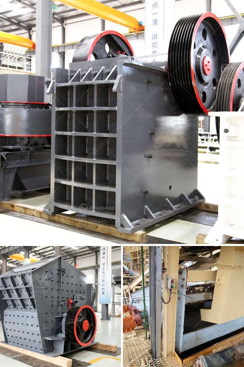

<h3>cost of glass aggregate machines</h3>
Glass recycling has become an increasingly popular method of waste management, as it offers a sustainable solution for reducing the amount of glass waste that ends up in landfills. One key component of glass recycling is the use of glass aggregate machines, which are designed to process glass waste and turn it into usable aggregate for various applications. However, the cost of these machines can vary greatly depending on various factors. In this article, we will explore the cost of glass aggregate machines and the factors that influence their prices.

The first factor that affects the cost of glass aggregate machines is the size and capacity of the machine. Machines with larger capacities and higher processing rates tend to be more expensive. For instance, a machine that can process 10 tons of glass waste per hour will be more costly than a machine that can only process 5 tons per hour. Additionally, machines with larger hoppers or storage areas may require more material handling equipment, which can also increase the cost.

Another factor that impacts the cost of glass aggregate machines is the level of automation and technology integrated into the machine. Machines equipped with advanced automation features, such as computerized controls and sensors, can be more expensive than machines with basic manual controls. The level of automation can also affect the operational efficiency and productivity of the machine, ultimately impacting the overall return on investment.

The quality and durability of the machine's components and materials used in its construction can also influence the cost. Machines made with high-quality materials and components are likely to come at a higher price point but can offer better performance and longevity. Investing in a durable machine can reduce maintenance and repair costs over time, making it a more cost-effective option in the long run.

Additionally, the brand and reputation of the manufacturer can also play a role in the cost of glass aggregate machines. Established and reputable manufacturers often command higher prices for their machines due to their track record of delivering reliable and high-quality products. However, it is essential to do thorough research and compare prices, as sometimes lesser-known manufacturers can offer comparable machines at a lower cost.

Other factors that can contribute to the cost of glass aggregate machines include the availability of spare parts and the level of customer service and support provided by the manufacturer. Machines with readily available spare parts can be more expensive initially but can save significant costs in the event of breakdowns or maintenance needs. Similarly, manufacturers that offer comprehensive customer service and technical support may charge a premium for their machines.

It is important to evaluate the cost of glass aggregate machines in the context of the benefits they provide. Investing in a high-quality machine that meets your processing needs can lead to substantial cost savings in waste disposal fees and materials procurement. Moreover, recycling glass waste through these machines offers environmental benefits by conserving natural resources and reducing carbon emissions associated with the production of virgin aggregate materials.

In conclusion, the cost of glass aggregate machines can vary significantly depending on factors such as machine size, automation level, quality of materials, brand reputation, and customer support. It is crucial to carefully assess your processing requirements and budget constraints before investing in a glass aggregate machine. By doing thorough research and comparing options, you can find a machine that offers the best value for money and contributes to a sustainable waste management strategy.
<h3>Contact us</h3><ul><li><strong>Whatsapp:&nbsp;<a href="https://wa.me/8613661969651">+8613661969651</a></strong></li><li><a href="https://swt.shibang-china.com/?git&amp;zhl&amp;cost of glass aggregate machines"><strong>Online Service(chat now)</strong></a></li></ul><h3>Related</h3><ul><li><a href='quartz plus wet grinder.md'>quartz plus wet grinder</a></li><li><a href='high efficient grinding mills for sale.md'>high efficient grinding mills for sale</a></li><li><a href='grinding roller mills manufacturer from china.md'>grinding roller mills manufacturer from china</a></li><li><a href='manufacturer of coal processing equipment.md'>manufacturer of coal processing equipment</a></li><li><a href='components of the hammer crusher.md'>components of the hammer crusher</a></li></ul>