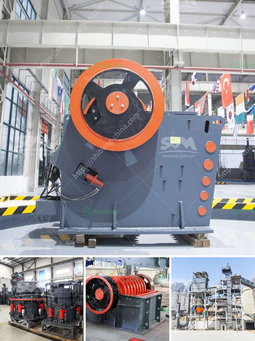

<h3>cost of quarry crusher machines</h3>
The cost of quarry crusher machines is an important factor to consider when choosing equipment for a quarry facility. Quarry projects that have been budgeted for will have higher chances of success than those that have not. These costs include the purchase price of the machine and any related expenses such as transportation, installation, and maintenance.

One of the main factors that will determine the cost of a quarry crusher machine is the type of machine being used. Different types of crushers have different specifications and features, which means different prices. The most common types of machines are jaw crushers, cone crushers, and impact crushers.

Jaw crushers are commonly used in quarries because of their ability to crush tough and abrasive materials such as granite and basalt. They are known for their high production capacity and low maintenance costs. However, they are more expensive compared to other types of crushers.

Cone crushers are another popular choice in quarries. They are known for their ability to produce finely crushed materials. Cone crushers are more expensive compared to jaw crushers, but they offer high productivity and efficiency, making them a good investment in the long run.

Impact crushers are versatile machines that can be used for various applications. They are often used for recycling and crushing concrete and asphalt materials. Impact crushers are relatively affordable compared to other types of crushers, but they may require more maintenance.

Apart from the type of machine, the size of the machine also affects its cost. Quarry crusher machines come in different sizes, with larger machines being more expensive. The size of the machine required depends on the size of the quarry and the desired output. Smaller quarries may only require smaller machines, while larger quarries may need larger machines to meet their production needs.

In addition to the purchase price, there are other costs to consider when investing in quarry crusher machines. Transportation costs can be significant, especially if the machine needs to be imported from a different location. Installation costs may also vary depending on the complexity of the machine and the site conditions.

Maintenance costs are another important factor to consider. Regular maintenance is crucial to ensure the longevity and efficiency of the machine. This includes routine inspections, lubrication, and replacement of parts when necessary. It is important to budget for these ongoing costs to ensure the machine performs optimally and avoids unexpected breakdowns.

In conclusion, the cost of quarry crusher machines is influenced by various factors including the type and size of the machine, transportation and installation costs, and ongoing maintenance expenses. It is important for quarry owners and operators to carefully consider these costs when planning and budgeting for their projects. By investing in high-quality and reliable machines and properly maintaining them, quarry operations can increase productivity and profitability in the long run.
<h3>Contact us</h3><ul><li><strong>Whatsapp:&nbsp;<a href="https://wa.me/8613661969651">+8613661969651</a></strong></li><li><a href="https://swt.shibang-china.com/?git&amp;zhl&amp;cost of quarry crusher machines"><strong>Online Service(chat now)</strong></a></li></ul><h3>Related</h3><ul><li><a href='grinding mill for quartz in to 500 mesh in india.md'>grinding mill for quartz in to 500 mesh in india</a></li><li><a href='stamp mill for sale in zimbabwe.md'>stamp mill for sale in zimbabwe</a></li><li><a href='vibrating feeder vs belt conveyor.md'>vibrating feeder vs belt conveyor</a></li><li><a href='buy fully gold mining wash plant.md'>buy fully gold mining wash plant</a></li><li><a href='aggregates for concrete crusher in nigeria.md'>aggregates for concrete crusher in nigeria</a></li></ul>