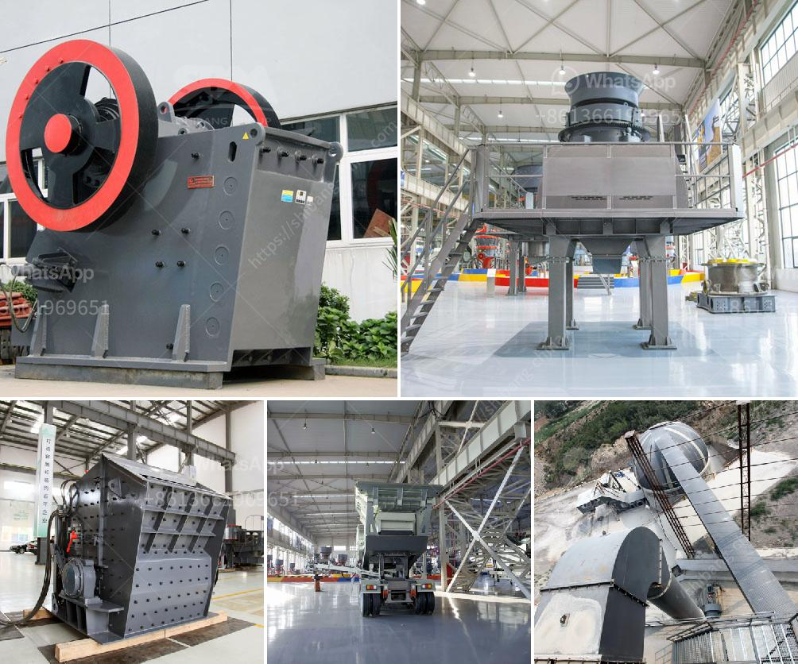

<h3>cost of setting a sand crushing plant in india</h3>
The demand for sand is increasing rapidly worldwide due to the growth of the construction industry. Unfortunately, natural sand resources are limited, and their extraction often leads to environmental issues such as erosion and ecological imbalance. In response to this, many countries, including India, are now promoting the use of manufactured sand (M-sand) as an alternative to natural sand. Setting up a sand crushing plant can be a complex process, but it is also an important step towards supplying the sand needed for various construction projects.

The cost of setting up a sand crushing plant in India is directly related to the size of the project. For small scale projects, the cost of setting up a sand crushing plant is less than that for large scale projects. For example, a small scale sand crushing plant with a capacity of 30 tph can be up to 50% cheaper than a large scale one with a capacity of 200 tph. When it comes to the price, this is determined by a variety of factors, including equipment and labor costs, government regulations, availability of raw materials, and transportation costs.

In terms of equipment costs, machinery like jaw crushers, vibrating screens, conveyors, and feeders are essential for a sand crushing plant. Depending on the specific requirements of the project, different types of machines may be needed, and their prices can vary. Additionally, the quality and reliability of the equipment play a crucial role in the overall cost. It is important to invest in well-established brands and reliable suppliers to ensure the longevity of the plant and avoid operational breakdowns.

Labor costs are another significant factor in the overall cost of setting up a sand crushing plant. Skilled workers with experience in operating and maintaining crushing plant equipment are essential for the smooth operation of the plant. Hiring skilled labor may require higher wages, but it is crucial to ensure the efficiency and productivity of the plant in the long run.

Government regulations also impact the cost of setting up a sand crushing plant. Permits and licenses required for the operation of the plant can vary from region to region. It is important to understand and comply with all the necessary regulations to avoid any legal complications that could increase the cost of the project. Engaging with local authorities and experts can help navigate through the regulatory procedures and avoid unnecessary expenditures.

Availability of raw materials is another critical aspect to consider. The cost of raw materials such as limestone or granite for the production of sand may vary based on their availability and transportation costs from the source to the plant. It is advisable to establish good relationships with local suppliers to ensure a consistent supply of quality raw materials at competitive prices.

Transportation costs can also significantly impact the overall cost of setting up a sand crushing plant. The distance between the source of raw materials and the plant location can affect the transportation expenses. Efficient logistics planning should be implemented to minimize transportation costs, including the use of local resources whenever feasible.

In conclusion, the cost of setting up a sand crushing plant in India depends on the size of the project, equipment and labor costs, government regulations, availability of raw materials, and transportation costs. Additionally, it is crucial to invest in reliable equipment and hire skilled labor to ensure the efficient operation and productivity of the plant. Considering these factors and careful planning will help optimize the overall cost and contribute to the successful establishment of a sand crushing plant.
<h3>Contact us</h3><ul><li><strong>Whatsapp:&nbsp;<a href="https://wa.me/8613661969651">+8613661969651</a></strong></li><li><a href="https://swt.shibang-china.com/?git&amp;zhl&amp;cost of setting a sand crushing plant in india"><strong>Online Service(chat now)</strong></a></li></ul><h3>Related</h3><ul><li><a href='components of the hammer crusher.md'>components of the hammer crusher</a></li><li><a href='manufacturer of coal processing equipment.md'>manufacturer of coal processing equipment</a></li><li><a href='mobile gold processing plant in russia.md'>mobile gold processing plant in russia</a></li><li><a href='price of grinder machine in bangladesh.md'>price of grinder machine in bangladesh</a></li><li><a href='benefits of vsi crusher.md'>benefits of vsi crusher</a></li></ul>