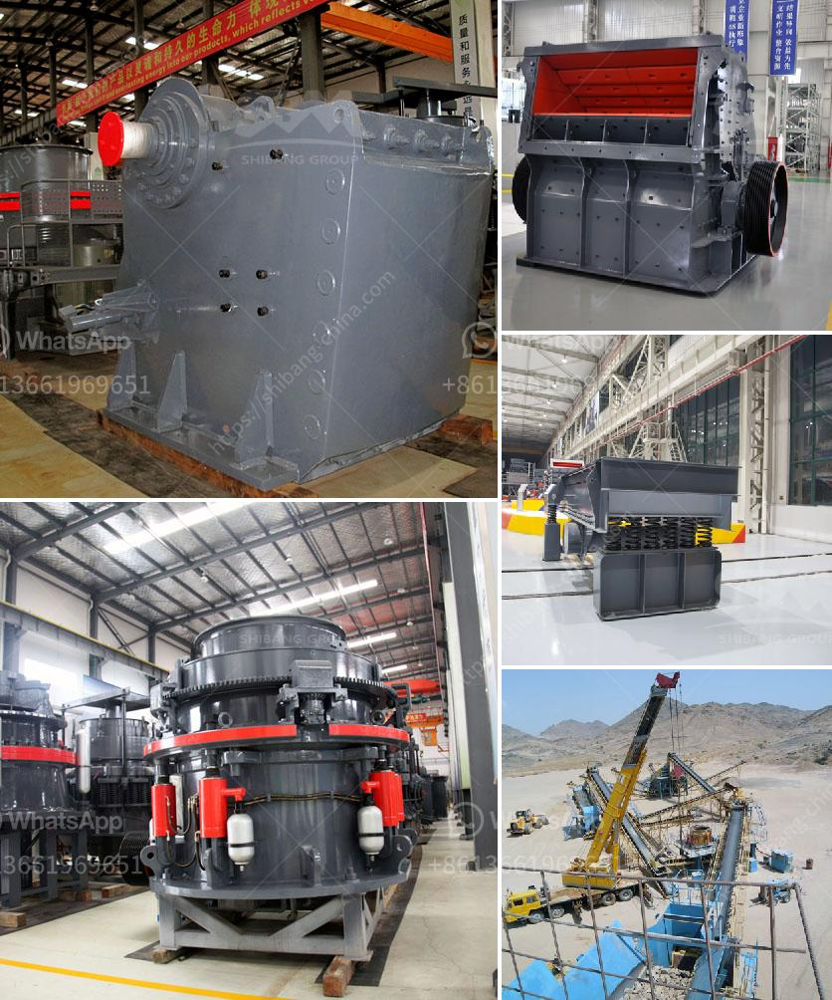

<h3>cost of setting up a quarry crusher in nigeria</h3>
The actual cost would be based on the scale the investor wants to start the business. The cost of the machinery required for the crushing of the stone which make up between 60-70 % of the cost of the establishing the business is based on the three factors which are the input of stone into the crusher, the availability of the machine and the size of the machine. As a quarry owner, you could sell to agents and suppliers or directly to the final user.

The technology and equipment used in the quarry site and surrounding area could affect the overall cost of setting up a quarry crusher. So investors should consider various factors to decide which model and specifications they need. Size, power, feeding material size, machine ore discharging size, wearing parts price, purchase price, working cost and so on should be taken into consideration.

There is a wide range of equipment types and models, including jaw crushers, cone crushers, impact crushers, vibrating screens, and vibrating feeders, which can be configured according to customer requirements. The specific configuration of the quarry crusher should be based on factors such as production requirements, capital budget, site conditions, energy consumption, and investment costs.

In conclusion, setting up a quarry crusher in Nigeria is indeed a business worth investing in. However, it requires significant capital, manpower, and machinery fleets, thus it is advisable for investors to conduct thorough market analysis and feasibility studies before making any investment in the quarry business. My Nigeria is richly endowed with granite stone and other related solid minerals like Marble, Dolomite and Basalt, etc. It is found in Enugu, Ebonyi, Kogi, Plateau, Ogun, Oyo, Osun, and Edo states, hence crushing granite could be a lucrative venture.
<h3>Contact us</h3><ul><li><strong>Whatsapp:&nbsp;<a href="https://wa.me/8613661969651">+8613661969651</a></strong></li><li><a href="https://swt.shibang-china.com/?git&amp;zhl&amp;cost of setting up a quarry crusher in nigeria"><strong>Online Service(chat now)</strong></a></li></ul><h3>Related</h3><ul><li><a href='magnesite processing plant.md'>magnesite processing plant</a></li><li><a href='used crusher mobile for sale in uae.md'>used crusher mobile for sale in uae</a></li><li><a href='second hand stone production line for.md'>second hand stone production line for</a></li><li><a href='rock crusher unit.md'>rock crusher unit</a></li><li><a href='pebble crusher shanghai manufacturers.md'>pebble crusher shanghai manufacturers</a></li></ul>