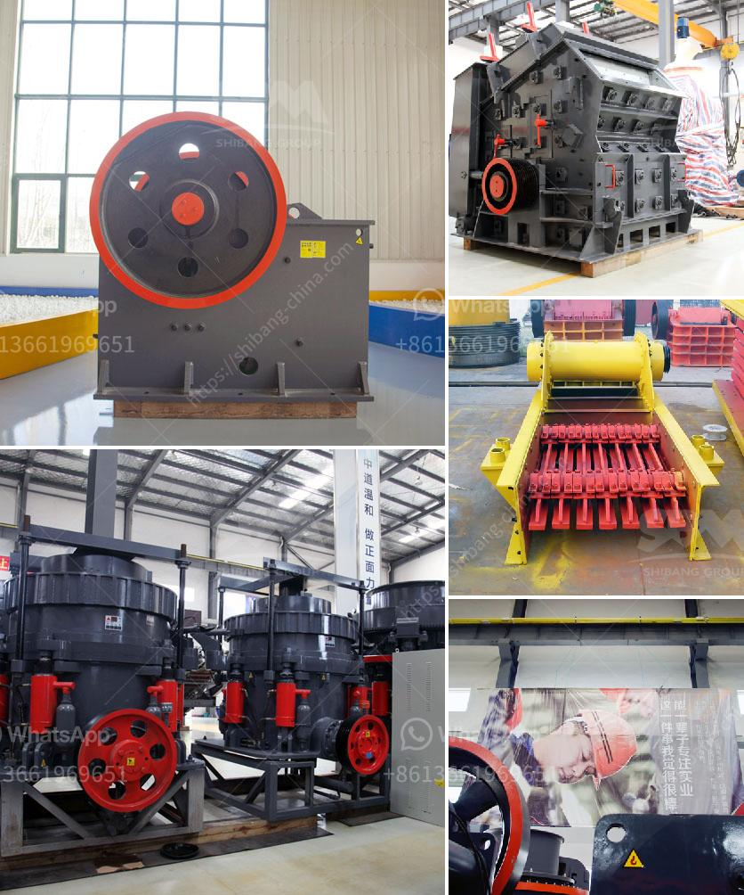

<h3>cost of setting up a quarry crusher plant</h3>
The quarrying industry is booming in many parts of the world, with quarries expanding their operations and becoming more productive than ever before. One of the key ingredients of successful quarrying is the ability to produce consistently high-quality aggregate, infusing crusher plants with modern technology to ensure efficient and effective operations.

Undoubtedly, the function of a crusher plant is to crush stones, rocks, or other hard materials for further processing. However, it is important to remember that the purpose of the plant is not only to crush stones but also to produce high-quality aggregate that is used for construction purposes.

Aggregate includes crushed stone, gravel, and sand. It is the foundation of the construction industry, providing the raw materials needed for buildings, roads, bridges, and more. Therefore, when setting up a quarry crusher plant, you need to ensure the material you produce is of the highest quality.

Before setting up a quarry crusher plant, you will need to conduct a comprehensive analysis of your area's geological composition. This involves analyzing various rock formations in the area to determine its suitability for the quarry.

Key considerations include the hardness, density, and stability of the rocks. Hard, dense rocks are ideal for crushing, as they provide the necessary strength to produce high-quality aggregate. Additionally, stable rock formations are essential to ensure the safety and stability of the quarry crusher plant.

Once you have determined the geological composition and suitability of your site, the next step is to investigate local regulations and permits required to set up a quarry crusher plant. These regulations may vary depending on your location and can include environmental and health and safety requirements.

It is crucial to comply with all regulations to ensure the ethical and legal operation of your quarry crusher plant. Failure to comply can result in fines, closure, or legal issues that can be detrimental to your business.

Since the geological composition and your specific needs may vary, the cost of setting up a quarry crusher plant can fluctuate. Some of the key factors to consider when determining your budget include:

1. Equipment: Crushers, screens, feeders, and other equipment are essential for the operation of a quarry crusher plant. High-quality and durable equipment can come at a higher cost but can provide better efficiency and longevity.

2. Labor: Hiring experienced and skilled labor is crucial for the proper operation and maintenance of your quarry crusher plant. Consider the cost of labor when determining your budget.

3. Operational costs: These include fuel, electricity, and maintenance costs. Ensure you factor these ongoing expenses into your budget.

4. Transportation: Consider the cost of transporting the raw materials and the finished product to and from your quarry crusher plant.

Setting up a quarry crusher plant requires careful planning and research to ensure you receive the equipment and support you need to achieve efficient and effective operations. Remember to budget accordingly and consider enlisting the help of industry professionals who can guide you through the entire process. With proper planning, your quarry crusher plant can become a profitable venture, producing high-quality aggregate for various construction projects.
<h3>Contact us</h3><ul><li><strong>Whatsapp:&nbsp;<a href="https://wa.me/8613661969651">+8613661969651</a></strong></li><li><a href="https://swt.shibang-china.com/?git&amp;zhl&amp;cost of setting up a quarry crusher plant"><strong>Online Service(chat now)</strong></a></li></ul><h3>Related</h3><ul><li><a href='components of the hammer crusher.md'>components of the hammer crusher</a></li><li><a href='mobile coal crusher price sa.md'>mobile coal crusher price sa</a></li><li><a href='jaw crushers kyrgyzstan.md'>jaw crushers kyrgyzstan</a></li><li><a href='manufacturer of rotary screen for crushed lime stone.md'>manufacturer of rotary screen for crushed lime stone</a></li><li><a href='mineral grinding mill machine used for sale uk.md'>mineral grinding mill machine used for sale uk</a></li></ul>