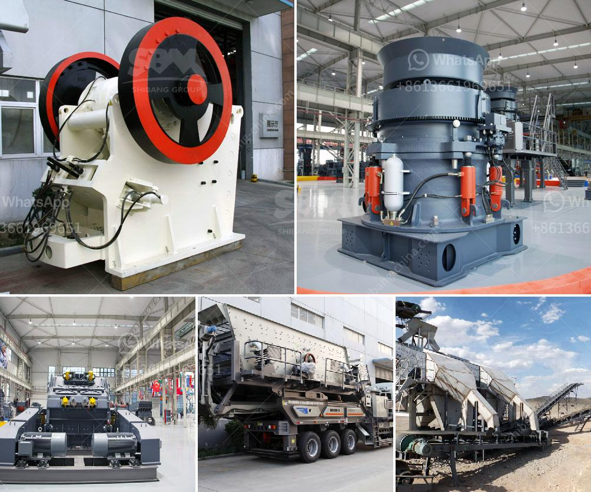

<h3>cost of setting up a quarry crusher</h3>
The cost of the machinery required for setting up a quarry crusher plant is minimal, as the crushers are already in place. The machines used in the quarry are: jaw crushers, impact crushers, cone crushers, vertical shaft impact crushers, sand making machines, vibrating screens, vibrating feeders, belt conveyors and other crushing equipment.

We will first examine the quarry crusher machines, as they are the most widely used and come in various configurations and sizes. The properties of the rocks being crushed and the output desired will determine the size and capacity of the crusher machines.

In terms of cost, the machinery is priced differently according to factors such as capacity, size, material being processed, and customization options. Generally, jaw crushers cost less than impact crushers in the initial purchase cost. Jaw crushers produce less fines and hence have a higher initial cost per ton compared to impact crushers that produce high fines.

A secondary cone crusher can be used to further reduce the size of the rock, and a tertiary crusher usually operated in closed circuit, will produce a final product size ranging from 20mm to 40mm.

The machinery required for setting up a quarry crusher plant will depend on the type and scale of the operations being carried out. Generally, small-scale quarrying operations will require a smaller machine, while larger operations will require heavier and more expensive machinery.

Other factors affecting the cost of setting up a quarry crusher plant include the source of the raw materials, transportation costs, labor costs, power costs, and licensing fees. There may also be costs associated with obtaining necessary permits and complying with environmental regulations.

Overall, setting up a quarry crusher plant requires a lot of upfront investment. However, the cost is justified when considering the potential income generated by the quarry's operations. It is essential to carefully consider all factors and conduct a thorough cost-benefit analysis before making a decision on setting up a quarry crusher plant.
<h3>Contact us</h3><ul><li><strong>Whatsapp:&nbsp;<a href="https://wa.me/8613661969651">+8613661969651</a></strong></li><li><a href="https://swt.shibang-china.com/?git&amp;zhl&amp;cost of setting up a quarry crusher"><strong>Online Service(chat now)</strong></a></li></ul><h3>Related</h3><ul><li><a href='nigeria cone crusher photos.md'>nigeria cone crusher photos</a></li><li><a href='flow chart of three stage agreegate crushing plant.md'>flow chart of three stage agreegate crushing plant</a></li><li><a href='stone quarry crusher in kasoa.md'>stone quarry crusher in kasoa</a></li><li><a href='belt conveyor untuk batubara.md'>belt conveyor untuk batubara</a></li><li><a href='zambia mining conveyor belt.md'>zambia mining conveyor belt</a></li></ul>