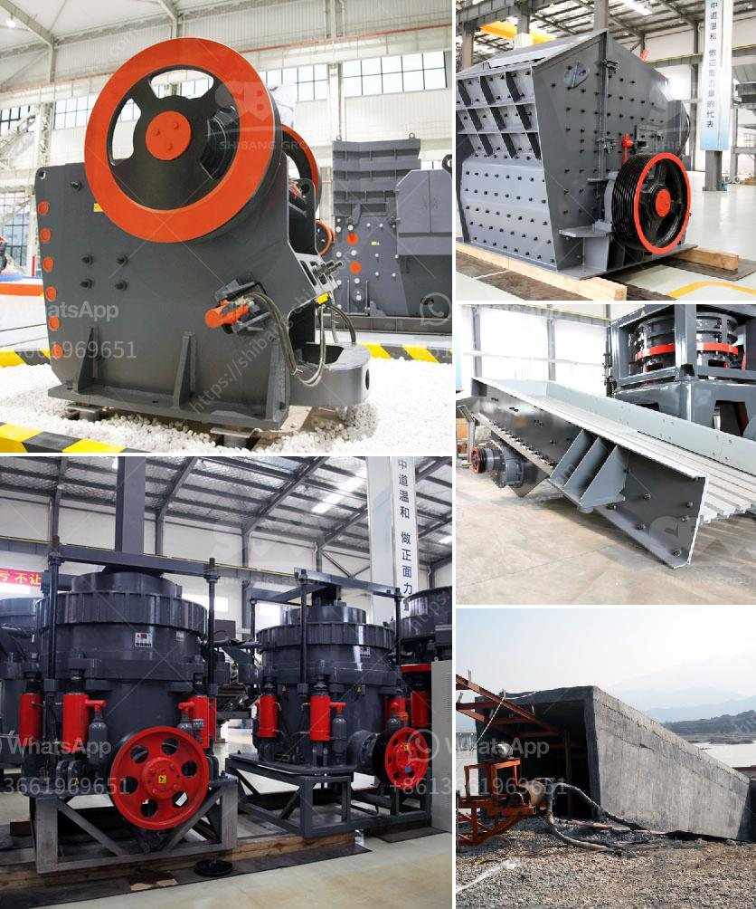

<h3>cost of setting up a quarry plant</h3>
The quarry plant is a type of open-pit mine from which rock or minerals are extracted. Quarries are commonly used for extracting building materials, such as dimension stone, construction aggregate, riprap, sand, and gravel. They are often colocated with concrete and asphalt plants due to the requirement for large amounts of aggregate in those materials.

Setting up a quarry plant is a big project, it needs big money in the starting stage. To invest in a quarry plant, investors have different considerations: the specific investment budget, the technical and financial expertise, the promised return on investment, safety measures, and environmental concerns.

The cost of setting up a quarry plant depends on the specific requirements of the project. In general, there are three main factors that determine the cost: the first is the type and size of the quarry plant, the second is the location of the quarry plant, and the third is the specific needs of the project itself.

The type and size of the quarry plant can vary greatly. There are different types of quarries, such as rock quarries, gravel pits, and sand quarries. The size of the quarry plant can range from small to large, depending on the scale of the project. The cost of equipment, machinery, and plants required for the quarry will also depend on the size of the quarry plant.

The location of the quarry plant is another important factor in determining the cost. The availability and cost of land, permits, and regulatory requirements can vary depending on the location. Quarry plants located in remote areas may require more infrastructure, such as roads and power supply, which can add to the cost of setting up the plant.

The specific needs of the project will also impact the cost of setting up a quarry plant. For example, if the project requires specialized equipment or processes, such as crushing and screening plants, the cost may be higher. Additionally, if the project requires environmental remediation or safety measures, such as water management systems or dust control, the cost can increase.

In conclusion, setting up a quarry plant is a significant investment that requires careful planning and consideration. The cost of setting up a quarry plant will depend on various factors, including the size and type of the quarry plant, the location, and the specific needs of the project. It is important for investors to conduct a thorough feasibility study and cost analysis before committing to such a project. Proper planning and budgeting will help ensure the success and profitability of the quarry plant in the long run.
<h3>Contact us</h3><ul><li><strong>Whatsapp:&nbsp;<a href="https://wa.me/8613661969651">+8613661969651</a></strong></li><li><a href="https://swt.shibang-china.com/?git&amp;zhl&amp;cost of setting up a quarry plant"><strong>Online Service(chat now)</strong></a></li></ul><h3>Related</h3><ul><li><a href='feldspar crusher price.md'>feldspar crusher price</a></li><li><a href='coal powder making.md'>coal powder making</a></li><li><a href='quartz grinding plants in philippines.md'>quartz grinding plants in philippines</a></li><li><a href='manufacturer of crushing equipment philippines.md'>manufacturer of crushing equipment philippines</a></li><li><a href='jaw crusher 24x12 price.md'>jaw crusher 24x12 price</a></li></ul>