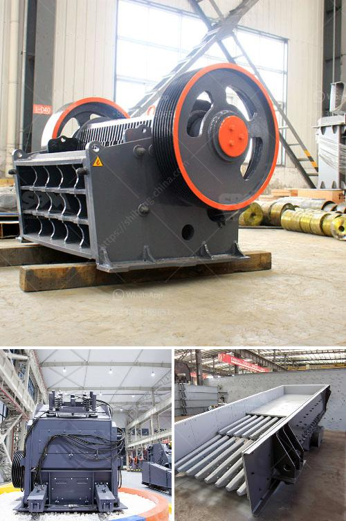

<h3>cost of setting up quarry plant in nigeria</h3>
Quarrying is an integral part of the building and construction industry. As a matter of fact, building and construction work is virtually impossible without the availability of quality limestone and granite aggregates. These materials are also used for roads, bridges, parking lots, housing foundation, landscaping, and so much more.

Setting up a quarry plant is not an easy task, as it requires significant planning, investment, and expertise. In Nigeria, there are many cost-saving factors that are involved in quarry production, which could make it a viable option for investors.

1. Investigate the site: This includes analyzing the soil and rocks to determine the amount of minerals present. It is also important to know the quality, quantity, and accessibility of the materials.

2. Acquire the necessary permits: You need to obtain the required licenses and permits from relevant government agencies. This includes the Ministry of Mines and Steel Development, Environmental Protection Agency, and community leaders.

3. Purchase or lease equipment: You will need to invest in heavy machinery such as excavators, loaders, crushers, and trucks. These are essential for quarry operations and productivity.

4. Transportation and logistics: Consider the cost of transporting materials from the quarry to the market. Ensure you have a reliable transportation system in place.

5. Maintain a good relationship with the community: Quarry operations can sometimes cause damages to the environment, so it is crucial to have a good relationship with the community. This will involve compensating affected individuals and implementing sustainability measures.

The cost of setting up a quarry plant in Nigeria ranges from $300,000 to $10 million, which depends on the size, scale, and nature of the site. Some of the basic steps involved in setting up a quarry in Nigeria are:

1. Survey the quarry site: You need to evaluate the quarry site, its viability, and logistics for maximum profitability.

2. Get the necessary permits: Acquire all necessary licenses and permits from relevant government agencies to ensure compliance with regulations.

3. The purchase of equipment: Invest in the necessary machinery and equipment for efficient operations.

4. Hire skilled and experienced personnel: Employ professionals who understand the intricacies of quarrying to ensure smooth operations.

5. Develop a marketing strategy: Establish partnerships with construction companies and other potential buyers to ensure a steady market for quarry materials.

In conclusion, setting up a quarry plant in Nigeria can be a complex process, but it has the potential to be lucrative. The steps highlighted above should be followed meticulously to ensure a successful and profitable operation. With the right planning, investment, and execution, a quarry plant can become a fulfilling and sustainable business venture in Nigeria.
<h3>Contact us</h3><ul><li><strong>Whatsapp:&nbsp;<a href="https://wa.me/8613661969651">+8613661969651</a></strong></li><li><a href="https://swt.shibang-china.com/?git&amp;zhl&amp;cost of setting up quarry plant in nigeria"><strong>Online Service(chat now)</strong></a></li></ul><h3>Related</h3><ul><li><a href='stone crushing machines for sale.md'>stone crushing machines for sale</a></li><li><a href='kenya jaw crusher for sale.md'>kenya jaw crusher for sale</a></li><li><a href='smallest cement plant.md'>smallest cement plant</a></li><li><a href='equipment required for the work of granite quarry.md'>equipment required for the work of granite quarry</a></li><li><a href='full quarry machines for sale in china.md'>full quarry machines for sale in china</a></li></ul>