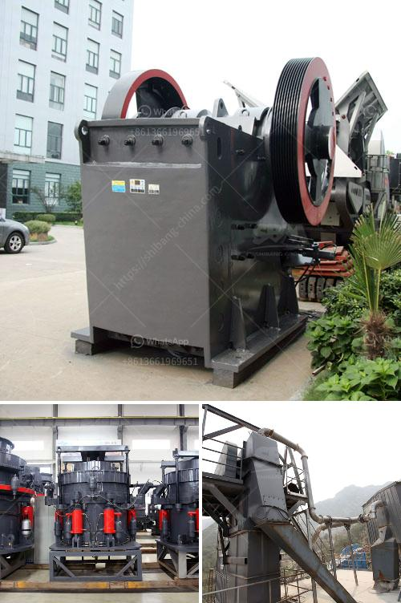

<h3>cost of silica sand mine equipment</h3>
The cost of silica sand mine equipment is an important factor when determining the viability of a silica sand mine project. As the equipment used for silica sand mining is costly, it is crucial to evaluate the necessary equipment investment before starting any mining operation.

Silica sand mining involves the extraction of silica sand from the earth's surface. This sand is used for various applications in industries such as glass manufacturing, construction, and oil and gas production. The mining process typically involves the use of heavy equipment to excavate and transport silica sand.

The cost of silica sand mine equipment can vary greatly depending on the scale of the mining operation and the specific equipment required. Basic mining equipment, such as excavators and trucks, can range from just a few hundred thousand dollars to several million dollars. In addition to these primary machines, other equipment such as crushers, screens, and conveyors may also be necessary in larger mining operations.

The cost of equipment can also be influenced by factors such as the location of the mine and the availability of local suppliers. Transporting heavy equipment to remote mine sites can increase costs significantly, as can the need to source specialized equipment from overseas suppliers.

It is essential for mining companies to carefully evaluate the cost of silica sand mine equipment to ensure the financial feasibility of their projects. This includes considering the upfront investment costs, ongoing maintenance and repair costs, and the potential cost of equipment replacement or upgrade in the future.

Additionally, mining companies may also need to consider the cost of environmental compliance and land reclamation as part of their overall equipment investment.

In conclusion, the cost of silica sand mine equipment plays a crucial role in determining the profitability of a silica sand mining operation. It is important for mining companies to conduct a thorough cost analysis to ensure that the investment in equipment aligns with their financial goals and the specific requirements of the mining project.
<h3>Contact us</h3><ul><li><strong>Whatsapp:&nbsp;<a href="https://wa.me/8613661969651">+8613661969651</a></strong></li><li><a href="https://swt.shibang-china.com/?git&amp;zhl&amp;cost of silica sand mine equipment"><strong>Online Service(chat now)</strong></a></li></ul><h3>Related</h3><ul><li><a href='used zenith crusher sales nigeria.md'>used zenith crusher sales nigeria</a></li><li><a href='price of plant mobile crusher.md'>price of plant mobile crusher</a></li><li><a href='mobile stone crusher for sale philippines.md'>mobile stone crusher for sale philippines</a></li><li><a href='crusher for cobble.md'>crusher for cobble</a></li><li><a href='crusher plant operator in crusher.md'>crusher plant operator in crusher</a></li></ul>