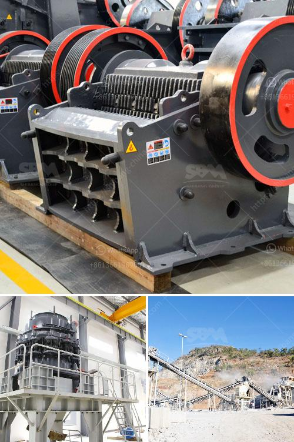

<h3>cost of small scale cement factory</h3>
A small scale cement factory is an ideal business option for individuals who are looking for a steady source of income and have a passion for entrepreneurship. With the increasing demand for cement in various construction projects, setting up a cement manufacturing plant can be a profitable venture.

The cost of establishing a small scale cement factory can vary depending on several factors. These include the location, size, and production capacity of the plant. Additionally, the cost of raw materials, machinery, labor, utilities, and transportation should also be taken into consideration.

To set up a small scale cement factory, an entrepreneur needs to conduct research to determine the most suitable location for the plant. Factors such as proximity to limestone reserves, availability of transportation infrastructure, and access to markets should be considered. The cost of land will also be a significant expense.

The next major expense is machinery and equipment. A cement factory requires machinery such as crushers, mills, separators, conveyors, and fans. The cost of these machines can range from thousands to millions of dollars, depending on their quality and capacity.

Raw materials, primarily limestone and clay, are essential for cement production. The cost of sourcing these materials can vary depending on their availability and transportation expenses. It is essential to establish relationships with reliable suppliers to ensure a steady and cost-effective supply.

Labor costs are another significant consideration. Skilled workers, such as engineers, technicians, and plant operators, will be required to ensure the smooth operation of the factory. Hiring qualified personnel and providing competitive wages will incur expenses.

Utilities such as electricity, water, and fuel are crucial for running a cement factory. The cost of these utilities will depend on the plant's location and the availability and pricing of resources in that area. It is essential to factor in these expenses when calculating the overall cost.

Transportation costs should also be considered. Cement bags or bulk cement may need to be transported to customers or distributors. The distance and logistics involved will contribute to the transportation expenses.

In conclusion, setting up a small scale cement factory requires careful planning and consideration of various expenses. The total cost of establishing such a factory can range from hundreds of thousands to millions of dollars, depending on various factors. Thorough research, cost analysis, and financial planning are essential for a successful venture in the cement industry.
<h3>Contact us</h3><ul><li><strong>Whatsapp:&nbsp;<a href="https://wa.me/8613661969651">+8613661969651</a></strong></li><li><a href="https://swt.shibang-china.com/?git&amp;zhl&amp;cost of small scale cement factory"><strong>Online Service(chat now)</strong></a></li></ul><h3>Related</h3><ul><li><a href='roller grinding machines for sale.md'>roller grinding machines for sale</a></li><li><a href='lime powder making machine.md'>lime powder making machine</a></li><li><a href='top crusher manufacturer.md'>top crusher manufacturer</a></li><li><a href='price stone crusher suppliers.md'>price stone crusher suppliers</a></li><li><a href='ball mill manufacturers south africa.md'>ball mill manufacturers south africa</a></li></ul>