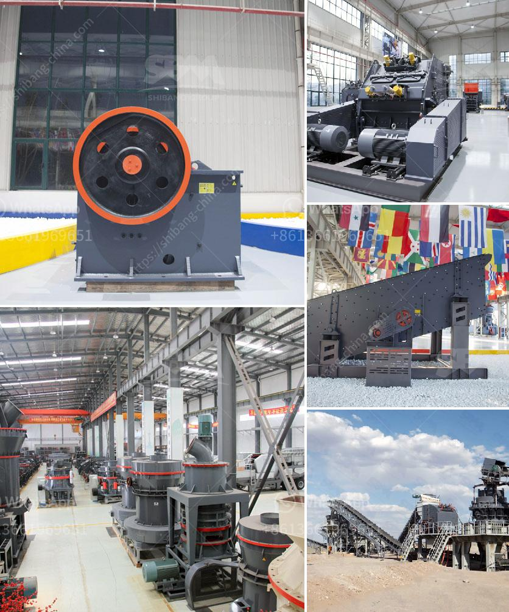

<h3>costo equipos de la planta de cemento</h3>
Los costos de los equipos en una planta de cemento son parte fundamental para su correcto funcionamiento y producción eficiente. Estos equipos se encargan de diferentes procesos dentro de la planta, y su adquisición y mantenimiento representan una significativa inversión para la empresa.

Uno de los equipos más importantes en una planta de cemento es el horno rotatorio. Este horno es utilizado para calcinar la materia prima y producir el clinker, que posteriormente será procesado para obtener el cemento final. El costo de un horno rotatorio puede variar considerablemente según su capacidad y tecnología. Un horno de tamaño estándar puede oscilar entre los 2 y 5 millones de dólares, aunque los más grandes y modernos pueden superar los 10 millones.

Además del horno rotatorio, otra pieza clave en la planta de cemento son los molinos de cemento. Estos equipos se encargan de triturar el clinker y otros componentes en polvo fino, que luego se mezclarán para obtener el cemento final. Los molinos de cemento son de alta tecnología y su costo puede variar dependiendo del tamaño y capacidad de producción. Un molino de cemento puede llegar a costar entre 1.5 y 3 millones de dólares.

Otro equipo costoso en una planta de cemento es el separador de polvo o filtro de mangas. Estos equipos se utilizan para controlar la emisión de partículas de polvo en el aire durante diferentes etapas del proceso de producción. Un separador de polvo puede tener un costo que va desde los 500,000 hasta el millón de dólares, dependiendo de su capacidad y eficiencia.

Además de los equipos principales, también se requieren otros equipos de apoyo en una planta de cemento, como los sistemas de transporte de materiales, transportadores de banda, silos de almacenamiento, sistemas de enfriamiento, entre otros. El costo de estos equipos varía en función de sus características y capacidades. En general, se estima que los costos de los equipos auxiliares pueden alcanzar hasta el 30% del costo total de la planta.

Es importante mencionar que estos costos son solo la inversión inicial en la adquisición de los equipos. Además, se deben considerar los costos de mantenimiento y reparación a lo largo de la vida útil de los equipos. Estos costos pueden ser significativos, especialmente en equipos de alta tecnología, y deben ser incluidos en el presupuesto de la planta de cemento.

En conclusión, los equipos en una planta de cemento representan una inversión significativa para la empresa. Desde el horno rotatorio, pasando por los molinos de cemento y los separadores de polvo, hasta los equipos auxiliares, todos desempeñan un papel crucial en la producción eficiente de cemento. Además del costo inicial de adquisición, se deben considerar los costos de mantenimiento a lo largo de la vida útil de los equipos. Es fundamental realizar un análisis detallado de los costos y beneficios de cada equipo antes de su adquisición para garantizar el éxito y rentabilidad de la planta de cemento.
<h3>Contact us</h3><ul><li><strong>Whatsapp:&nbsp;<a href="https://wa.me/8613661969651">+8613661969651</a></strong></li><li><a href="https://swt.shibang-china.com/?git&amp;zhl&amp;costo equipos de la planta de cemento"><strong>Online Service(chat now)</strong></a></li></ul><h3>Related</h3><ul><li><a href='stone quarry crusher in kasoa.md'>stone quarry crusher in kasoa</a></li><li><a href='roller raymond mill with best price.md'>roller raymond mill with best price</a></li><li><a href='advantage of wet grinding in cement manufacturing.md'>advantage of wet grinding in cement manufacturing</a></li><li><a href='gold stone crusher images.md'>gold stone crusher images</a></li><li><a href='fine grinding mills.md'>fine grinding mills</a></li></ul>