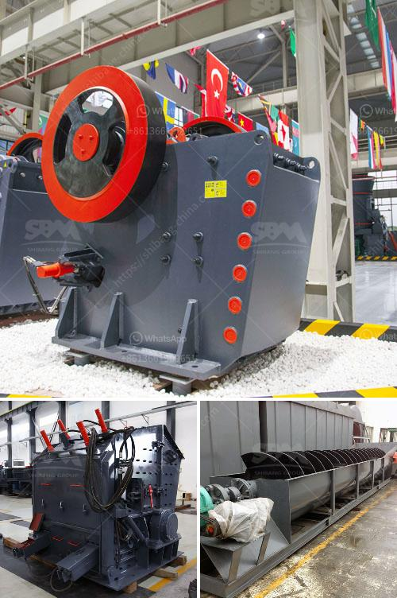

<h3>crawler mobile crushers</h3>
Crawler mobile crushers have become increasingly popular in the mining industry because of their ease of use and compactness. These versatile machines are capable of processing different types of materials, which makes them highly efficient in many applications.

One of the advantages of crawler mobile crushers is their excellent mobility. This feature allows them to move easily on different types of terrain, even in the most challenging environments. Whether it's a construction site or a quarry, crawler mobile crushers can adapt to various conditions, making them ideal for on-site crushing.

Another key feature of crawler mobile crushers is their high productivity. These machines are designed to process large quantities of material in a short amount of time. Their powerful engines and heavy-duty construction enable them to crush rocks, concrete, and other materials with ease. This means that operators can achieve higher production rates, reducing overall project time and costs.

In addition to their high productivity, crawler mobile crushers offer excellent fuel efficiency. The utilization of advanced technology and optimized components allows these machines to consume less fuel compared to traditional crushers. This not only saves money for operators but also contributes to environmental conservation by reducing CO2 emissions.

Furthermore, crawler mobile crushers are equipped with advanced control systems that ensure efficient operation. These systems include features such as remote control, allowing operators to operate the crusher from a safe distance. This enhances safety on-site, especially in hazardous areas where manual operation may pose risks.

The compact design of crawler mobile crushers is another advantage worth mentioning. These machines can be easily transported from one site to another, reducing transportation costs and time. Additionally, their compactness enables them to be placed directly at the crushing site, eliminating the need for additional equipment or infrastructure.

Crawler mobile crushers are also highly customizable, with various configurations available to suit different applications. For example, they can be equipped with different types of screens, conveyors, and crushers to meet specific requirements. This versatility allows operators to adjust the crushing process according to the material type and desired output size.

Overall, crawler mobile crushers offer numerous advantages for the mining industry. Their mobility, high productivity, fuel efficiency, and safety features make them an ideal choice for on-site crushing operations. Additionally, their compactness, customizability, and ease of use make them a valuable asset in various applications.

As technology continues to advance, we can expect further improvements in crawler mobile crushers. Manufacturers are constantly researching and developing new features and technologies to enhance their performance and efficiency. With these advancements, crawler mobile crushers will continue to play a vital role in the mining industry, providing efficient and cost-effective solutions for crushing operations.
<h3>Contact us</h3><ul><li><strong>Whatsapp:&nbsp;<a href="https://wa.me/8613661969651">+8613661969651</a></strong></li><li><a href="https://swt.shibang-china.com/?git&amp;zhl&amp;crawler mobile crushers"><strong>Online Service(chat now)</strong></a></li></ul><h3>Related</h3><ul><li><a href='coal wash plants for sale in malaysia.md'>coal wash plants for sale in malaysia</a></li><li><a href='alluvial chrome wash plant in zimbabwe.md'>alluvial chrome wash plant in zimbabwe</a></li><li><a href='big stone quarry business plan pdf.md'>big stone quarry business plan pdf</a></li><li><a href='demand and supply of stone ballast in kenya.md'>demand and supply of stone ballast in kenya</a></li><li><a href='shafts for hammer mills.md'>shafts for hammer mills</a></li></ul>