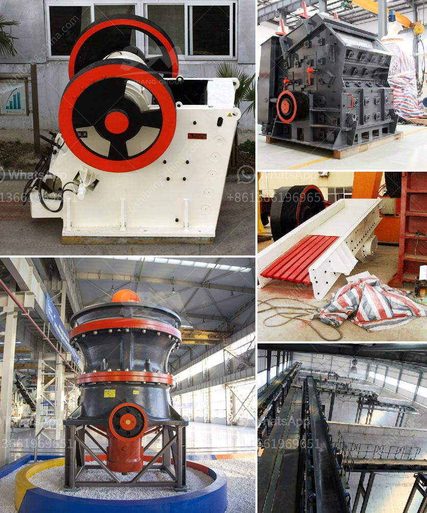

<h3>crush plant prices in pakistan</h3>
Crush plant prices in Pakistan vary depending on different factors such as the quality of the machinery, the size of the crushing plant, and the production capacity. Let's delve into the details.

Crushing plants are an important part of many industrial and construction projects in Pakistan. The machinery used in these plants plays a crucial role in the crushing of stones, rocks, and minerals, producing aggregates or other raw materials for various applications.

The price range for crush plants in Pakistan can range from tens of thousands to millions of dollars. This huge price disparity is primarily due to the different types of machinery available and their capabilities.

Smaller crush plants with lower production capacities typically have lower prices. These plants are suitable for small-scale projects or businesses that have a limited demand for crushed materials.

On the other hand, larger crush plants with higher production capacities are more expensive due to their ability to handle larger quantities of materials. These plants are ideal for larger construction projects or businesses that require a consistent supply of crushed materials.

Another factor that influences the price of crush plants in Pakistan is the quality of the machinery. High-quality machinery typically costs more due to its durability, efficiency, and advanced features. Investing in high-quality machinery ensures the longevity of the plant and reduces the risk of breakdowns, leading to increased productivity and cost savings in the long run.

Furthermore, the availability of spare parts and after-sales services also impact the price of crush plants. Plants from well-established manufacturers or suppliers often come with reliable support and readily available spare parts, which can affect the overall cost.

In conclusion, crush plant prices in Pakistan vary depending on factors such as the size, production capacity, quality of machinery, and after-sales services. It is essential for businesses or individuals planning to invest in a crush plant to consider their specific requirements and budget constraints while also prioritizing the quality and longevity of the machinery.
<h3>Contact us</h3><ul><li><strong>Whatsapp:&nbsp;<a href="https://wa.me/8613661969651">+8613661969651</a></strong></li><li><a href="https://swt.shibang-china.com/?git&amp;zhl&amp;crush plant prices in pakistan"><strong>Online Service(chat now)</strong></a></li></ul><h3>Related</h3><ul><li><a href='iron ore concentrate machinery.md'>iron ore concentrate machinery</a></li><li><a href='mtw trapezium mill.md'>mtw trapezium mill</a></li><li><a href='mining screens and crushing equipment.md'>mining screens and crushing equipment</a></li><li><a href='roller crusher for sale gumtree.md'>roller crusher for sale gumtree</a></li><li><a href='company profile for suppliers of mining equipment.md'>company profile for suppliers of mining equipment</a></li></ul>