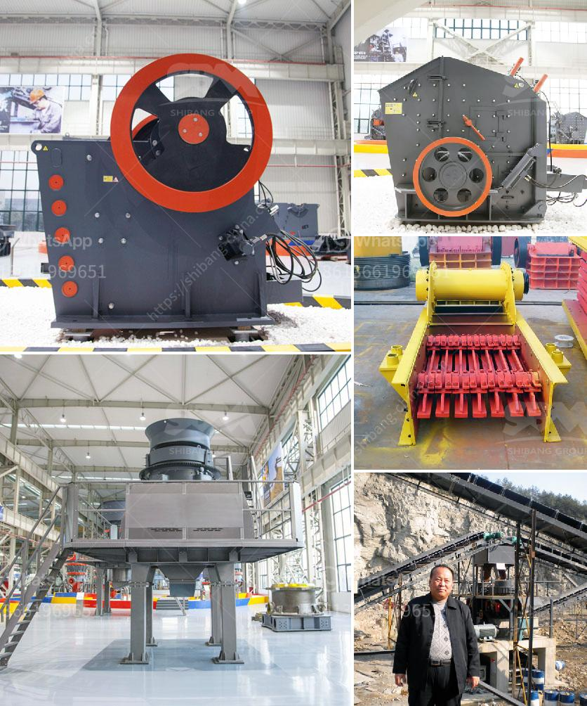

<h3>crush stone machinery</h3>
When it comes to construction, crushed stones are essential. These materials are used for various purposes, such as road construction, foundation laying, and landscaping. To obtain these crushed stones, heavy machinery is required. That's where crusher machines come into play. Crush stone machinery has revolutionized the construction industry, making the process of obtaining crushed stones more efficient and convenient.

Crush stone machinery refers to machinery used to crush large stones into stone chips, gravel, and sand. These stones are crushed by mechanical force, typically through a combination of impact, compression, and attrition. This machinery consists of a primary crusher, followed by secondary crushers, screens, and conveyors. The primary crusher breaks the stone into smaller pieces, while secondary crushers further reduce its size, and screens and conveyors separate and transport the crushed stones.

One of the significant advantages of crush stone machinery is its ability to produce high-quality crushed stones in large quantities. This machinery can process a wide range of stone materials, including limestone, granite, basalt, and river stones, to produce different sizes and shapes of crushed stones, depending on specific construction requirements. With the use of various crushers, the machinery can produce stone chips, gravel, and sand within seconds, eliminating the need for manual labor and saving valuable time on construction sites.

Moreover, crush stone machinery offers cost savings for construction projects. The use of this machinery reduces the need for traditional stone crushing methods, which involve multiple steps, manual labor, and a significant amount of time. By automating the stone-crushing process, crush stone machinery reduces the overall project duration, resulting in cost savings. The efficiency and speed of this machinery also decrease the chances of delays, ensuring smooth project execution.

Safety is another crucial aspect enhanced by crush stone machinery. Traditional stone-crushing methods involve significant manual labor, exposing workers to potential hazards such as injuries from falling stones, dust inhalation, and muscle strain. With the use of crush stone machinery, workers' involvement in the stone-crushing process is minimal, ensuring their safety. Additionally, advanced features such as automated feeding and crushing systems contribute to a safer working environment.

Furthermore, crush stone machinery promotes environmental sustainability in the construction industry. Crushed stones are natural resources that need to be responsibly extracted. By utilizing crush stone machinery, the crushing process becomes more efficient, requiring fewer stones to be quarried. This reduces the impact on the environment and minimizes the depletion of natural resources. Additionally, this machinery is designed to minimize dust emission and noise pollution, addressing environmental concerns associated with traditional stone-crushing methods.

In conclusion, crush stone machinery has transformed the construction sector by providing an efficient, cost-effective, and sustainable solution for obtaining crushed stones. With the ability to produce high-quality crushed stones in large quantities, this machinery streamlines construction projects while ensuring safety on-site. By reducing the reliance on manual labor and traditional stone-crushing methods, crush stone machinery elevates the construction industry to new heights. As technologies continue to advance, we can expect further innovations in the crush stone machinery sector, further optimizing construction processes and benefiting the industry as a whole.
<h3>Contact us</h3><ul><li><strong>Whatsapp:&nbsp;<a href="https://wa.me/8613661969651">+8613661969651</a></strong></li><li><a href="https://swt.shibang-china.com/?git&amp;zhl&amp;crush stone machinery"><strong>Online Service(chat now)</strong></a></li></ul><h3>Related</h3><ul><li><a href='copper mining in zambia.md'>copper mining in zambia</a></li><li><a href='small ball mill price.md'>small ball mill price</a></li><li><a href='india stone crusher machine.md'>india stone crusher machine</a></li><li><a href='puzzolana crusher plant nairobi kenya.md'>puzzolana crusher plant nairobi kenya</a></li><li><a href='200tpd gold processing plant.md'>200tpd gold processing plant</a></li></ul>