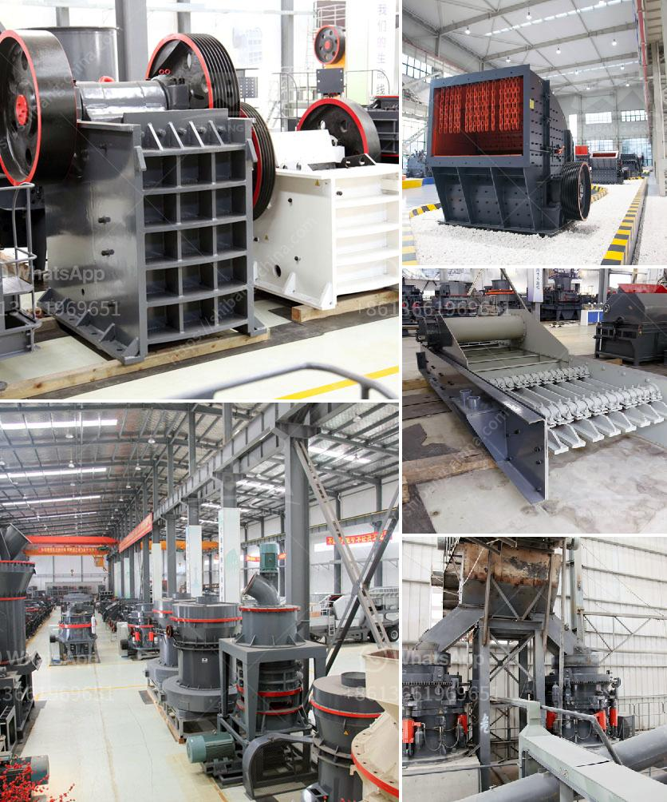

<h3>crusher china jaw crusher cost</h3>
With the rapid development of infrastructure projects, the demand for high-quality construction materials has also increased exponentially. Among these materials, crushed stones play a vital role in creating a solid foundation for various structures. As a result, crushers, especially jaw crushers, have become an essential tool for the construction industry. In this article, we will explore the cost of jaw crushers in China, highlighting their affordability and contribution to the industry.

First and foremost, jaw crushers are known for their efficiency in crushing different types of materials. They use a compressive force to break larger rocks into smaller ones, making them ideal for a wide range of applications. From roads and bridges to residential and commercial buildings, the construction industry heavily relies on the production of crushed stones. Therefore, a cost-effective jaw crusher that can produce high-quality materials is indispensable.

In recent years, China has emerged as a leading player in the global jaw crusher market. The country's vast manufacturing capabilities, combined with its lower labor costs, have allowed Chinese manufacturers to offer competitive prices without compromising on quality. As a result, customers across the world have turned to China for their jaw crusher needs.

When it comes to the cost of jaw crushers in China, several factors contribute to their affordability. Firstly, Chinese manufacturers benefit from economies of scale due to their large production capacities. This advantage allows them to spread fixed costs over a greater number of units, resulting in lower per-unit costs. Additionally, the intense competition within the Chinese market drives manufacturers to constantly innovate and optimize their production processes, further reducing costs.

Furthermore, China's investment in research and development has resulted in significant improvements in jaw crusher technology. Manufacturers have been able to develop crushers with higher crushing ratios and increased efficiency, allowing for greater output without compromising on energy consumption. These advancements have not only reduced costs but also improved the overall performance of jaw crushers.

Moreover, the Chinese government has implemented various policies and incentives to support the manufacturing industry. These initiatives have further contributed to the affordability of jaw crushers in China. For instance, manufacturers may benefit from tax breaks, access to low-cost financing, and streamlined administrative procedures, all of which help reduce production costs.

It is worth mentioning that although the cost of jaw crushers in China is generally lower compared to other countries, buyers should still consider several factors before making a purchase. Quality assurance, after-sales service, and warranty terms should all be carefully evaluated to ensure a reliable and long-lasting crusher that meets the specific requirements of the project.

In conclusion, the cost of jaw crushers in China has made them an attractive option for the construction industry worldwide. Leveraging the country's manufacturing capabilities and favorable policies, Chinese manufacturers have been able to offer cost-effective solutions without compromising on quality. As infrastructure projects continue to surge, having access to affordable jaw crushers will significantly contribute to the construction industry's growth and development.
<h3>Contact us</h3><ul><li><strong>Whatsapp:&nbsp;<a href="https://wa.me/8613661969651">+8613661969651</a></strong></li><li><a href="https://swt.shibang-china.com/?git&amp;zhl&amp;crusher china jaw crusher cost"><strong>Online Service(chat now)</strong></a></li></ul><h3>Related</h3><ul><li><a href='crushing equipment in south africa.md'>crushing equipment in south africa</a></li><li><a href='technical parametres of impact crusher.md'>technical parametres of impact crusher</a></li><li><a href='grinding machine manufacturers ethiopia.md'>grinding machine manufacturers ethiopia</a></li><li><a href='portable sand washing machine.md'>portable sand washing machine</a></li><li><a href='calculation of production mobile crushers.md'>calculation of production mobile crushers</a></li></ul>