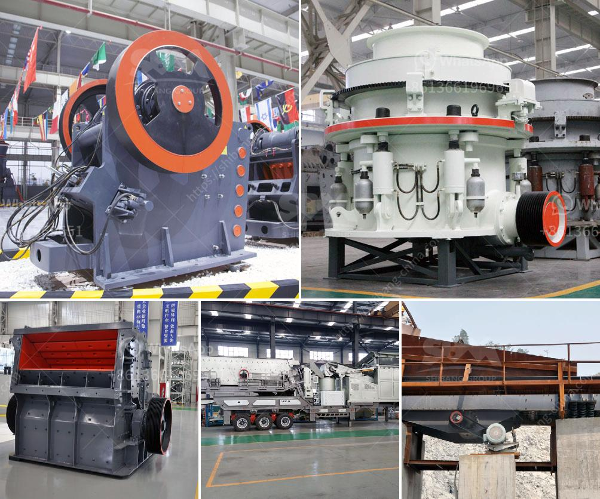

<h3>crusher conveyor belts zimbabwe</h3>
Zimbabwe has always been a country with a strong mining tradition and mineral resources such as gold, platinum, coal, nickel, copper, and diamonds. With vast untapped deposits, there is significant potential for Zimbabwe to become a leading player in the mining industry. As mining operations expand, the demand for efficient and reliable conveyor systems like crusher conveyor belts continues to grow.

A crusher conveyor belt is a unique equipment that is used to crush stones or rocks into smaller pieces for further processing. The device works by utilizing high-powered electric motors and endless loops of a rubber belt to transfer the stones or rocks to the crusher machine. These conveyor belts are essential in mining operations as they enable the continuous transportation of raw materials, preventing any downtime in the production process.

One company in Zimbabwe that has embraced the importance of crusher conveyor belts is the renowned mining supply company, Varumark. With over 30 years of experience in the industry, Varumark has been providing top-quality products to the mining sector, including crusher conveyor belts. Their belts are designed to withstand harsh mining conditions and provide maximum durability, reducing maintenance costs and increasing efficiency.

The significance of efficient conveyor systems in the mining industry cannot be overlooked. With the continuous advancements in mining technology, the demand for faster and more reliable equipment is increasing. In Zimbabwe, the need for conveyor belts that can handle heavy loads and transport materials from one location to another at a faster pace is crucial for the overall success of mining operations.

Additionally, crusher conveyor belts play a vital role in improving workplace safety. By automating the transportation process, workers are exposed to fewer risks, such as accidents caused by manually handling heavy materials. With the use of conveyor belts, the physical strain on workers is significantly reduced, resulting in a safer working environment.

The crusher conveyor belt industry in Zimbabwe has witnessed substantial growth in recent years. This growth can be attributed to several factors, including government initiatives to promote mining and increased investments from both local and foreign companies. The positive economic outlook has also contributed to the growth of this industry, with more mining companies exploring new mining sites and expanding their existing operations.

Looking ahead, the future of the crusher conveyor belts industry in Zimbabwe seems promising. As the mining sector continues to grow, the demand for conveyor belts is expected to rise further. The technological advancements in conveyor belt design and manufacturing are also likely to contribute to the industry's growth. With continuous innovation and the introduction of more efficient and durable conveyor belts, Zimbabwe is poised to become a key player in the global mining industry.

In conclusion, the crusher conveyor belts industry in Zimbabwe is undergoing significant growth and presents numerous opportunities for local and international businesses. With the government's support and the increasing demand for efficient conveyor systems in the mining sector, this industry is set to thrive. As the country continues to exploit its vast mineral resources, investing in high-quality conveyor belts will play a crucial role in enhancing productivity, safety, and overall efficiency in the mining operations.
<h3>Contact us</h3><ul><li><strong>Whatsapp:&nbsp;<a href="https://wa.me/8613661969651">+8613661969651</a></strong></li><li><a href="https://swt.shibang-china.com/?git&amp;zhl&amp;crusher conveyor belts zimbabwe"><strong>Online Service(chat now)</strong></a></li></ul><h3>Related</h3><ul><li><a href='project report on quartz industries.md'>project report on quartz industries</a></li><li><a href='mobile crushers for sale in south africa.md'>mobile crushers for sale in south africa</a></li><li><a href='clay crusher manufacture process.md'>clay crusher manufacture process</a></li><li><a href='jaw crusher indonesia agent.md'>jaw crusher indonesia agent</a></li><li><a href='ballast crusher machine prices in kenya.md'>ballast crusher machine prices in kenya</a></li></ul>