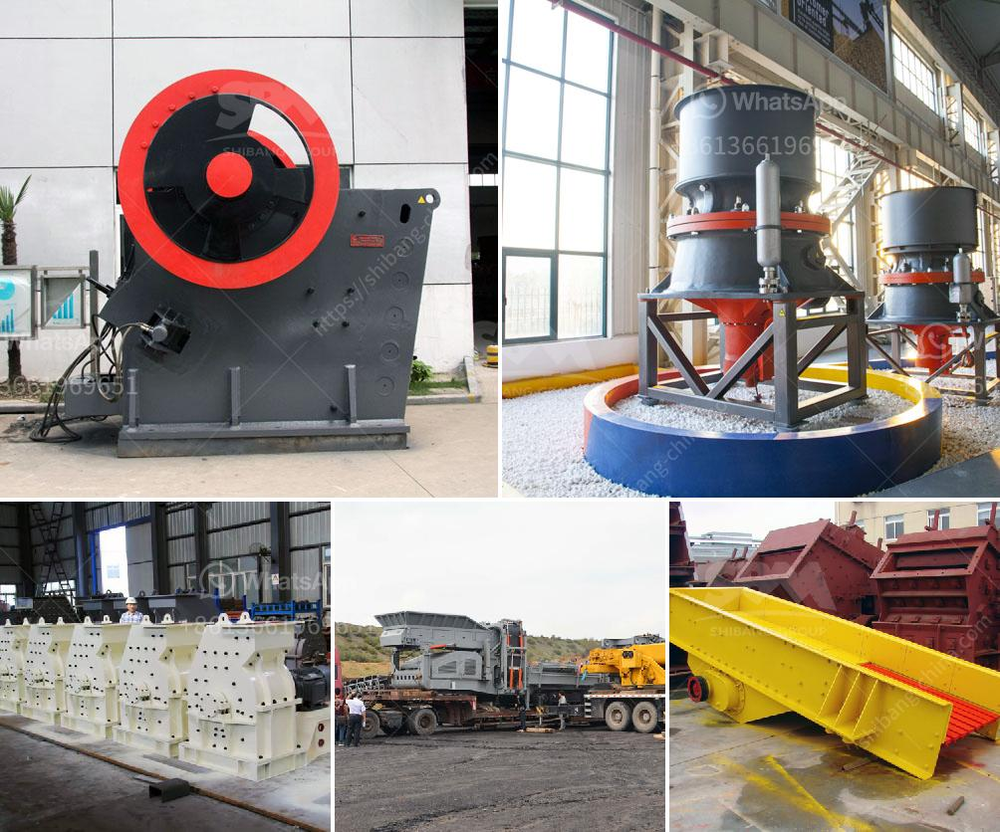

<h3>crusher cost of crusher of jaw</h3>
Crushers are machines used to break down materials such as rocks, into smaller, more manageable pieces. The jaw crusher is one of the most commonly used machines in the mining industry. It compresses materials between two plates, one stationary and one movable, to create a smooth and continuous crushing action.

When it comes to purchasing a jaw crusher, several factors need to be considered, including the cost of the machine. Understanding the cost of a crusher is essential to determine the return on investment it can provide.

The cost of a jaw crusher can vary depending on the capacity, size, and type of machine. Different models have different features and specifications, which can impact the price. Additionally, the brand and reputation of the manufacturer also play a role in determining the cost.

One of the primary factors influencing the cost of a jaw crusher is its capacity. The capacity refers to the maximum amount of material the crusher can process in a given time frame. Jaw crushers are available in various sizes and capacities ranging from a few tons per hour to hundreds of tons per hour. Machines with higher capacity are generally more expensive than those with lower capacity.

Size is another factor that affects the cost of a jaw crusher. Smaller machines are typically more affordable, while larger machines tend to be pricier. The size of the machine needed depends on the type and amount of material that needs to be crushed.

Furthermore, the type of jaw crusher can impact the cost. There are two main types of jaw crushers: single toggle and double toggle. Single toggle crushers are simpler and less expensive, but they have a lower throughput capacity compared to double toggle crushers. Double toggle crushers, on the other hand, have a higher production capacity but come at a higher cost.

Apart from the machine itself, other costs associated with operating a jaw crusher should also be considered. These costs include maintenance, repairs, and power consumption. Regular maintenance is crucial to ensure the crusher operates efficiently and prolong its lifespan. Repairs can also add to the overall cost, especially if the machine experiences unexpected breakdowns. Lastly, the power consumption of the jaw crusher should be factored in as it impacts the operational cost.

In conclusion, the cost of a jaw crusher can vary significantly depending on factors such as capacity, size, type, brand, and additional operating costs. It is essential to carefully consider these factors before making a purchase decision. Investing in a high-quality and efficient crusher may come with a higher upfront cost; however, it can result in lower maintenance and operational expenses in the long run.
<h3>Contact us</h3><ul><li><strong>Whatsapp:&nbsp;<a href="https://wa.me/8613661969651">+8613661969651</a></strong></li><li><a href="https://swt.shibang-china.com/?git&amp;zhl&amp;crusher cost of crusher of jaw"><strong>Online Service(chat now)</strong></a></li></ul><h3>Related</h3><ul><li><a href='ball mills sizes.md'>ball mills sizes</a></li><li><a href='big stone quarry business plan pdf.md'>big stone quarry business plan pdf</a></li><li><a href='slag grinding process.md'>slag grinding process</a></li><li><a href='small 100 ton rock crushing machine.md'>small 100 ton rock crushing machine</a></li><li><a href='pulverizer for carbon black.md'>pulverizer for carbon black</a></li></ul>