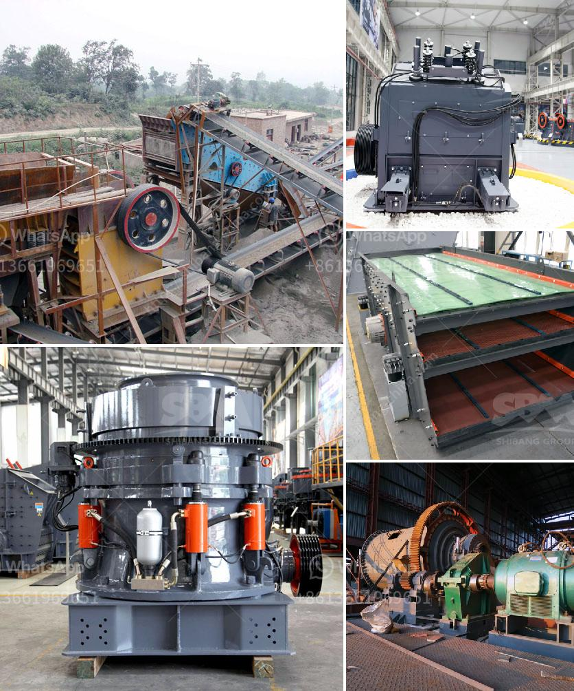

<h3>crusher equipment supplier</h3>
In the mining industry, crushers are an essential piece of equipment. They break down large rocks into more manageable sizes for further processing. As such, finding a reliable and efficient crusher equipment supplier is crucial for mining companies. These suppliers play a vital role in ensuring smooth operations and maximizing productivity in the industry.

A crusher equipment supplier offers a range of crushers that cater to various mining needs, from primary to tertiary crushing. They provide high-quality machines that are able to withstand the harsh conditions of mining operations. These crushers are designed to be durable, reliable, and energy-efficient, reducing downtime and increasing productivity.

One important factor to consider when choosing a crusher equipment supplier is their experience and reputation in the industry. A supplier with years of experience understands the unique challenges in the mining sector and can provide tailored solutions to meet specific requirements. They have a deep understanding of the different types of crushers and can recommend the most suitable one for a specific application.

Moreover, a reputable crusher equipment supplier offers comprehensive after-sales service, including maintenance and repairs. They have a team of skilled technicians who can provide technical support, ensuring that the crushers operate optimally. This minimizes downtime and helps mining companies to maintain high levels of productivity.

Additionally, a reliable supplier keeps up with technological advancements in the industry. They continuously invest in research and development to improve the efficiency and performance of their crushers. By partnering with such a supplier, mining companies can benefit from the latest innovations in crusher equipment.

In conclusion, a crusher equipment supplier is a vital partner for mining companies. Their high-quality machines, expertise, and comprehensive after-sales service are crucial in ensuring smooth operations and maximizing productivity. Mining companies should carefully choose a reputable supplier to ensure they have the right equipment for their specific needs, improving efficiency and profitability.
<h3>Contact us</h3><ul><li><strong>Whatsapp:&nbsp;<a href="https://wa.me/8613661969651">+8613661969651</a></strong></li><li><a href="https://swt.shibang-china.com/?git&amp;zhl&amp;crusher equipment supplier"><strong>Online Service(chat now)</strong></a></li></ul><h3>Related</h3><ul><li><a href='raymond gypsum mill in india.md'>raymond gypsum mill in india</a></li><li><a href='ball mill brochure eccentric outer cone crusher.md'>ball mill brochure eccentric outer cone crusher</a></li><li><a href='type of crushers.md'>type of crushers</a></li><li><a href='jaw crusher and cone crusher manufacturers in dubai.md'>jaw crusher and cone crusher manufacturers in dubai</a></li><li><a href='materials for zenith jaw crusher in europe.md'>materials for zenith jaw crusher in europe</a></li></ul>