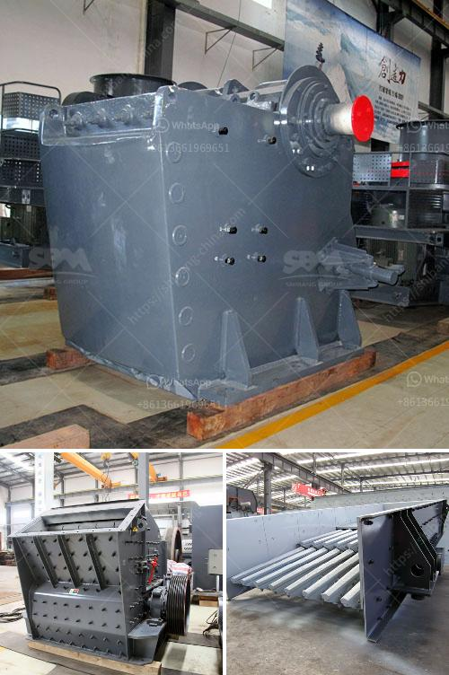

<h3>crusher factory in kenya</h3>
Kenya, known for its immense beauty and diverse culture, is one of the fastest-growing economies in East Africa. The country's rapid urbanization and increasing infrastructure projects have fueled the demand for construction materials, particularly stones and sand. In response to this growing need, crusher factories have emerged in Kenya to cater to the construction industry's requirements.

A crusher factory, also known as a stone crusher plant, is a specialized facility that processes stones into various sizes and grades of gravel. With the increasing demand for construction materials, the popularity of crusher factories in Kenya is at an all-time high. These factories play a crucial role in supplying stones, which are used as a base material for building roads, highways, bridges, and other infrastructure projects.

One of the leading crusher factories in Kenya is located in the Nairobi suburb of Embakasi. Spread across several acres of land, this factory houses state-of-the-art machinery capable of processing large quantities of stones with efficiency and precision. The factory operates round the clock, ensuring a steady supply of crushed stones to meet the construction industry's needs.

The crusher factory in Kenya employs skilled workers who are proficient in operating the advanced machinery. These workers receive specialized training to handle the equipment safely and effectively. From extracting stones from quarries to processing them into various sizes, every step is carefully executed to ensure the production of high-quality gravel.

It is worth noting that crusher factories in Kenya follow strict quality control measures to ensure that the stones produced meet the required standards. The stones are tested for their strength, durability, and size consistency, thus assuring the construction industry of reliable materials for their projects. This adherence to quality has earned these crusher factories a reputation for being reliable suppliers in the market.

Moreover, the crusher factory plays a significant role in boosting the local economy. It creates employment opportunities for the local community, helping to alleviate poverty and improve livelihoods. The wages earned by workers in these factories contribute to the growth of the local economy as they spend it on basic necessities, education, and healthcare. Additionally, the factories also indirectly support other industries, such as transportation and logistics, as they require a constant supply of raw materials and machinery.

However, despite their benefits, crusher factories in Kenya also face challenges. Environmental concerns, such as noise and dust pollution, have raised concerns among local communities living near these facilities. Steps are being taken to address these issues, including the installation of advanced dust suppression systems and regular monitoring to ensure compliance with environmental regulations.

In conclusion, the establishment of crusher factories in Kenya has provided a significant boost to the country's construction industry. These factories produce high-quality stones, serving as the backbone for various infrastructure projects. With their adherence to quality and commitment to the local economy, crusher factories have become a vital part of Kenya's development journey. Efforts to address any environmental concerns associated with these factories will further enhance their role in meeting the nation's construction needs.
<h3>Contact us</h3><ul><li><strong>Whatsapp:&nbsp;<a href="https://wa.me/8613661969651">+8613661969651</a></strong></li><li><a href="https://swt.shibang-china.com/?git&amp;zhl&amp;crusher factory in kenya"><strong>Online Service(chat now)</strong></a></li></ul><h3>Related</h3><ul><li><a href='crushing plant in the philippines.md'>crushing plant in the philippines</a></li><li><a href='price of grinding machine for europe.md'>price of grinding machine for europe</a></li><li><a href='sewa rental stone crusher.md'>sewa rental stone crusher</a></li><li><a href='mobile gold processing plant in russia.md'>mobile gold processing plant in russia</a></li><li><a href='iron ore crusher.md'>iron ore crusher</a></li></ul>