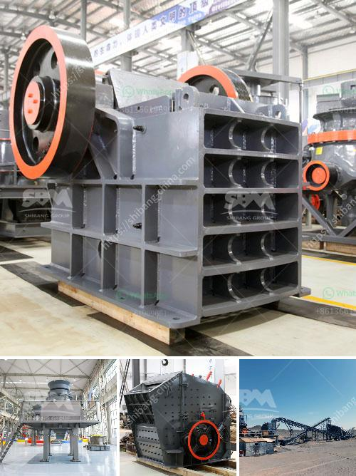

<h3>crusher for cobble</h3>
In the world of construction, cobblestones have always been prized for their durability and aesthetic appeal. From ancient roads to modern walkways, these small, round stones have stood the test of time, providing a solid foundation for countless structures. However, working with cobblestones in construction projects can often be a challenging task due to their uneven shapes and different sizes. This is where a crusher specifically designed for cobblestones comes into play, offering a convenient and efficient solution.

A crusher for cobble is a machine designed to pulverize cobblestones, reducing them into smaller sizes for construction purposes. It can be used in various settings, including construction sites, roadworks, and landscaping projects. The primary goal of a crusher for cobble is to break down the cobblestones into small, manageable pieces that can be used as bedding material, fillers, or even decorative elements.

One of the main advantages of using a crusher for cobble is its ability to process large quantities of cobblestones in a short period of time. By feeding cobblestones into the crusher, it quickly pulverizes them, producing a consistent size that can be easily handled and transported. This saves the construction team valuable time and resources, ensuring a smoother workflow and faster completion of the project.

Another benefit of using a crusher for cobble is the ability to control the desired size of the output material. Different construction projects may require cobblestones of varying sizes, depending on their specific needs. With a crusher, the size of the output material can be adjusted, allowing for greater flexibility in accommodating different project requirements. This ensures that the cobblestones are tailored to meet the demands of the construction project, enhancing its overall quality and durability.

Furthermore, a crusher for cobble is designed to handle the unique characteristics of cobblestones. These stones are known for their hardness and resistance to wear and tear. Unlike regular stones, cobblestones can withstand heavy loads and harsh weather conditions, making them ideal for high-traffic areas like driveways and pavements. A crusher specifically designed for cobblestones takes into account their tough nature, ensuring that the machine can effectively process and break them down without getting damaged.

In summary, a crusher for cobble offers numerous advantages for construction projects. It provides a convenient and efficient solution to process cobblestones, breaking them down into smaller, more manageable pieces. This saves time and resources, allowing for faster completion of the project. The ability to control the size of the output material ensures flexibility and customization according to specific project requirements. Finally, a crusher for cobble is designed to handle the unique characteristics of cobblestones, ensuring its durability and longevity. With all these benefits, it is no wonder that a crusher for cobble has become an essential tool in the construction industry.
<h3>Contact us</h3><ul><li><strong>Whatsapp:&nbsp;<a href="https://wa.me/8613661969651">+8613661969651</a></strong></li><li><a href="https://swt.shibang-china.com/?git&amp;zhl&amp;crusher for cobble"><strong>Online Service(chat now)</strong></a></li></ul><h3>Related</h3><ul><li><a href='mobile stone crusher plant.md'>mobile stone crusher plant</a></li><li><a href='kaolin processing machinery.md'>kaolin processing machinery</a></li><li><a href='dolomite crusher machine plant.md'>dolomite crusher machine plant</a></li><li><a href='quarry crusher equipments and machinery.md'>quarry crusher equipments and machinery</a></li><li><a href='standard cone crusher.md'>standard cone crusher</a></li></ul>