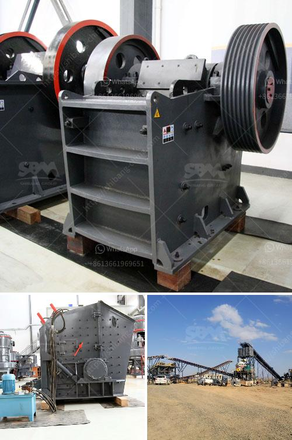

<h3>crusher for construction price</h3>
In the construction industry, a crusher is an essential piece of equipment that helps to process raw materials for various construction projects. From crushing rocks and stones to recycling demolition waste, crushers play a crucial role in efficiently reducing material size and ensuring the desired end product.

When considering the purchase of a crusher for construction purposes, one of the most important factors to consider is the price. Construction companies strive to optimize their budgets while ensuring they invest in equipment that will provide long-term value. A crusher with a reasonable price range can be a game-changer for construction companies, allowing them to maximize efficiency and reduce costs.

The price of a crusher for construction generally falls within the range of $100,000 to $300,000, depending on the model, specifications, and manufacturer. Factors such as capacity, power consumption, and maintenance requirements can impact the price. It is essential to evaluate these factors carefully to make an informed decision.

Higher-priced crushers often come with advanced features and capabilities, allowing for efficient crushing and increased productivity. They may offer larger capacity, faster operation, and better performance, resulting in substantial time savings and reduced labor costs. However, it is crucial to assess whether these features align with the specific needs of the construction project.

On the other hand, lower-priced crushers can still provide efficient crushing capabilities at a more affordable cost. Construction companies with smaller-scale projects or limited budgets can benefit from these crushers. However, it is essential to consider the durability, reliability, and maintenance requirements to ensure long-term value and avoid costly breakdowns.

In conclusion, when considering a crusher for construction, finding the right balance between price and functionality is crucial. Opting for a crusher within the price range of $100,000 to $300,000 can help construction companies maximize efficiency, reduce costs, and achieve their project goals. By carefully evaluating the specific needs of the project, construction companies can make an informed decision and invest in the most suitable crusher.
<h3>Contact us</h3><ul><li><strong>Whatsapp:&nbsp;<a href="https://wa.me/8613661969651">+8613661969651</a></strong></li><li><a href="https://swt.shibang-china.com/?git&amp;zhl&amp;crusher for construction price"><strong>Online Service(chat now)</strong></a></li></ul><h3>Related</h3><ul><li><a href='flowchart of a stone crushing plant.md'>flowchart of a stone crushing plant</a></li><li><a href='portable conveyor belts for sale.md'>portable conveyor belts for sale</a></li><li><a href='stone crusher machine rentals in ghana.md'>stone crusher machine rentals in ghana</a></li><li><a href='barite crusher machinery.md'>barite crusher machinery</a></li><li><a href='mobile rock crusher bend oregon.md'>mobile rock crusher bend oregon</a></li></ul>