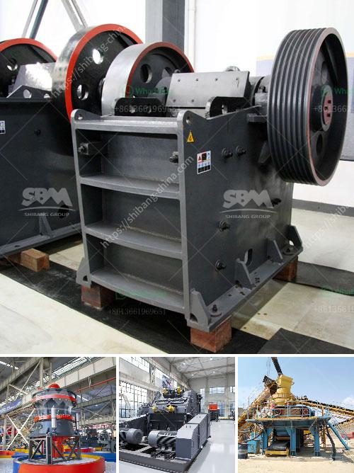

<h3>crusher for gravel</h3>
When it comes to constructing roads, buildings, or any other infrastructure, gravel is a fundamental material. It is used as a foundation and filler for various projects, making it an essential component in the construction industry. However, extracting, processing, and achieving the required particle size for gravel can be a challenging task. This is where a crusher for gravel becomes indispensable.

A crusher for gravel is a machine designed to break large rocks into smaller pieces. These crushers are used to produce gravel of various sizes that can be further used for a multitude of purposes. Whether it is for construction purposes, landscaping, or creating a base layer for asphalt, a crusher for gravel makes the process more efficient and less time-consuming.

One of the primary benefits of using a crusher for gravel is its versatility. These machines can handle various types of rock, including limestone, granite, and basalt, among others. This ensures that regardless of the type of gravel needed for a specific project, a crusher can efficiently process it.

Moreover, a crusher for gravel is available in different configurations, allowing operators to choose the most suitable machine for their specific needs. Jaw crushers, impact crushers, and cone crushers are common types of crushers used for gravel processing. Each offers unique features and benefits, enabling operators to achieve the desired gravel specifications.

The process of crushing gravel with a crusher starts with feeding the material into the machine. The rocks are then crushed between a fixed and a moving plate or jaws, depending on the type of crusher. The resulting gravel is discharged through an opening at the bottom, typically in the desired size range.

Apart from size reduction, crushers for gravel can also separate and remove impurities from the material. This ensures that the final product is of high quality and suitable for its intended application. Additionally, modern crushers for gravel are equipped with advanced technology and automation, making them not only efficient but also safe to use.

In conclusion, a crusher for gravel is an essential equipment for the construction industry. Its ability to break down large rocks, produce gravel of different sizes, and filter out impurities makes it invaluable in various construction projects. By choosing the right type of crusher and utilizing its versatile features, operators can efficiently and effectively process gravel for any application.
<h3>Contact us</h3><ul><li><strong>Whatsapp:&nbsp;<a href="https://wa.me/8613661969651">+8613661969651</a></strong></li><li><a href="https://swt.shibang-china.com/?git&amp;zhl&amp;crusher for gravel"><strong>Online Service(chat now)</strong></a></li></ul><h3>Related</h3><ul><li><a href='ball mill manufacturer india.md'>ball mill manufacturer india</a></li><li><a href='how to set up a granite quarry.md'>how to set up a granite quarry</a></li><li><a href='hammer mill technical.md'>hammer mill technical</a></li><li><a href='equipment used in limestone mining.md'>equipment used in limestone mining</a></li><li><a href='gypsum board manufacturing machine.md'>gypsum board manufacturing machine</a></li></ul>