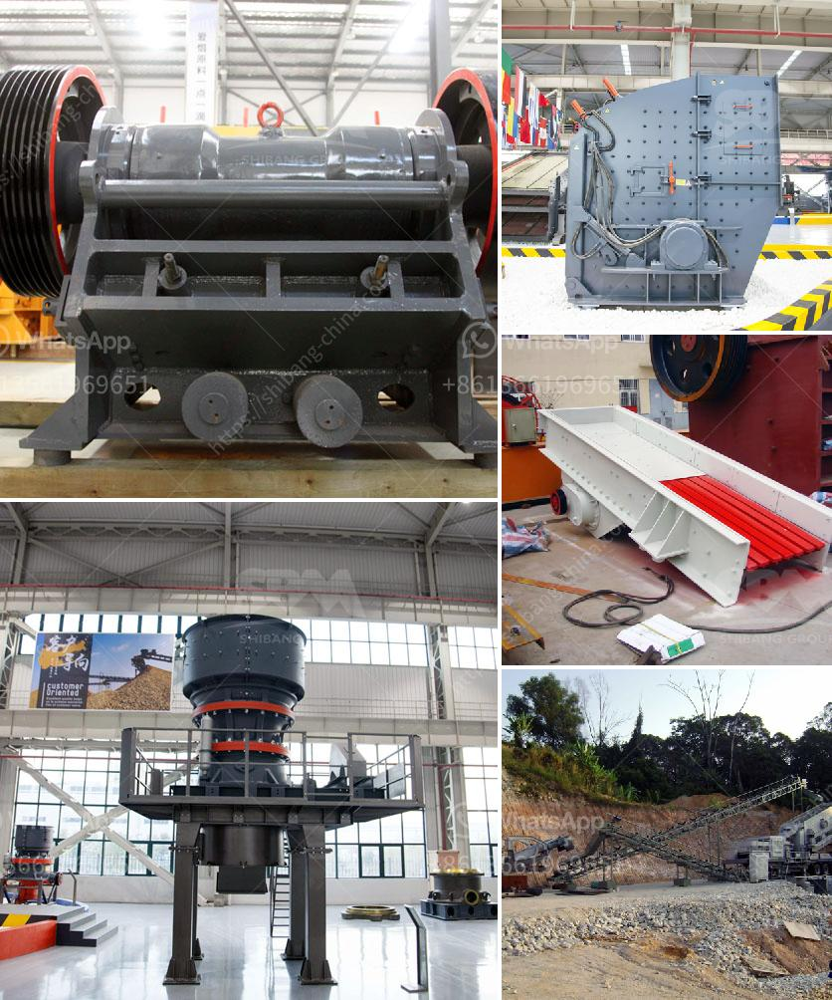

<h3>crusher for sale philippines</h3>
Crusher for sale Philippines is a smart investment for any construction company, keeping operational costs to a minimum and producing high-quality end products. To generate different sizes of crushed stone, the machine swiftly takes care of materials such as granite, limestone, and basalt. It makes the entire construction process more efficient and convenient, saving precious time and effort.

One of the primary advantages of having a crusher is its versatility. Whether it's a small-scale project or a large construction venture, crushers can handle any workload. With the ability to crush different types of material to various sizes, this machine is a perfect solution for different construction requirements.

Additionally, crushers are easy to transport from one site to another. This is advantageous for contractors who need to move their equipment frequently. Crusher for sale Philippines offers portability, which means the site's location is less restrictive. Contractors can easily bring the crusher to where the materials are or to multiple sites, reducing transportation costs.

Furthermore, crushers are highly efficient in terms of energy consumption. They are equipped with advanced technology and hydraulic systems, allowing for the crushing process to be completed with minimal power consumption. This reduces operational costs significantly, promoting sustainability while delivering excellent results.

When it comes to maintenance, crushers are built to last. Made with durable materials, these machines are designed to withstand the harsh demands of the construction environment. Regular maintenance and inspections are needed, but the sturdy construction of crusher for sale Philippines ensures longevity, minimizing breakdowns and costly repairs.

In addition to crushing materials, crushers can also separate them into different sizes, depending on the project requirements. This versatility allows contractors to produce high-quality aggregates that meet specific standards and specifications. The resulting products can be used for various construction purposes, including road base, concrete production, and general construction projects.

For construction businesses in the Philippines, investing in a crusher is a smart decision. It not only saves costs but also allows companies to consolidate their operations and streamline their workflow. By eliminating the need to transport materials to and from different locations, crushers help reduce traffic congestion and carbon emissions, making them an environmentally friendly choice.

Moreover, the demand for crushed stone in the Philippines is continuously growing, making crushers even more essential in the construction industry. As urbanization continues to expand, infrastructural developments are on the rise, boosting the need for high-quality aggregates.

In conclusion, crusher for sale Philippines is an investment that every construction site should consider. With its versatility, portability, efficiency, and durability, crushers are a game-changer in the construction industry. It not only saves time and money but also contributes to a more sustainable and efficient construction process. So, invest in a crusher today and witness the benefits it brings to your construction projects.
<h3>Contact us</h3><ul><li><strong>Whatsapp:&nbsp;<a href="https://wa.me/8613661969651">+8613661969651</a></strong></li><li><a href="https://swt.shibang-china.com/?git&amp;zhl&amp;crusher for sale philippines"><strong>Online Service(chat now)</strong></a></li></ul><h3>Related</h3><ul><li><a href='suppliers conveyor belts celaya.md'>suppliers conveyor belts celaya</a></li><li><a href='iron ore heavy duty equipments with photos.md'>iron ore heavy duty equipments with photos</a></li><li><a href='impact crusher machine manufacturer.md'>impact crusher machine manufacturer</a></li><li><a href='coal powder making.md'>coal powder making</a></li><li><a href='crusher industrial jaw crusher information.md'>crusher industrial jaw crusher information</a></li></ul>