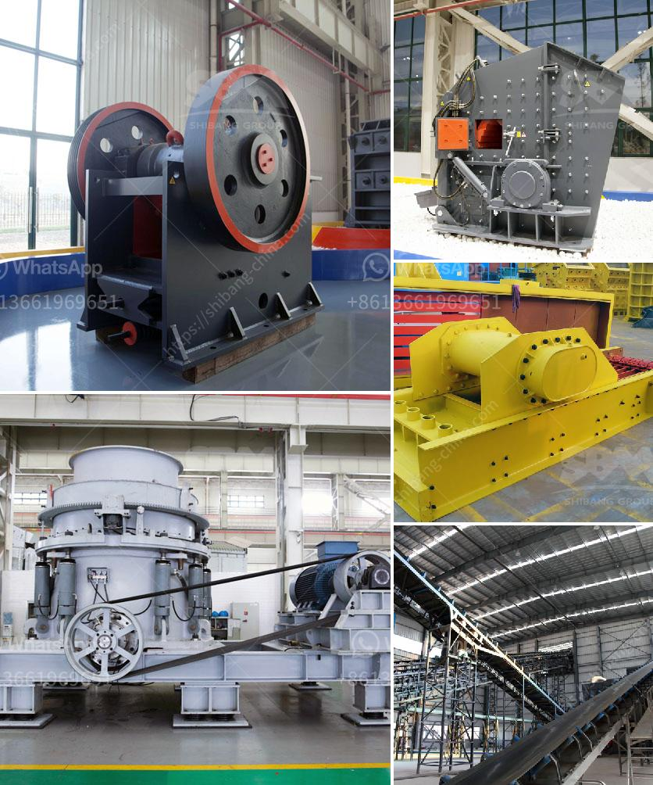

<h3>crusher hp300 cone</h3>
The HP300 cone crusher is a versatile machine that is engineered to be efficient, reliable, and easy to operate. This machine is of advanced design with a small footprint and high capacity in relation to its size. It is capable of producing high-quality aggregates such as limestone, granite, and basalt with a crushing force of up to 300 tons per hour.

One of the key features of the HP300 cone crusher is its automated control system. This advanced system electronically monitors and adjusts the settings of the crusher to optimize its performance and minimize downtime. The automated system also provides real-time information about the operating conditions of the machine, allowing operators to make informed decisions and take corrective actions to maintain optimal performance.

The HP300 cone crusher is equipped with the latest high-efficiency motors, making it more energy-efficient and environmentally friendly. It also features a hydraulic tramp release system that ensures quick and easy clearing of any blockages in the crushing chamber. This feature reduces downtime and increases the overall productivity of the machine.

In terms of safety, the HP300 cone crusher incorporates several features to protect both operators and the machine itself. It has a hydraulic overload protection system that prevents damage to the crusher in case of an uncrushable material entering the chamber. Additionally, the crusher is equipped with a self-lubricating seal ring that prevents dust and water from entering the internal components, further enhancing the durability and longevity of the machine.

Maintenance of the HP300 cone crusher is minimal, thanks to its robust construction and intelligent design. The crusher is designed with easy access to all major components, making maintenance tasks quick and hassle-free. Furthermore, the machine has a long service life due to its high-grade steel construction and durable components.

The HP300 cone crusher is suitable for various applications, ranging from aggregate production and mining to construction and demolition waste recycling. It can handle a wide range of materials, from soft to hard, and from dry to sticky. Its versatility makes it an ideal choice for producers in need of a reliable and efficient crushing solution.

In conclusion, the HP300 cone crusher is a powerful machine that provides high-capacity crushing in a compact design. Its automated control system, energy-efficient motors, and advanced safety features make it a reliable choice for crushing applications in various industries. With its low maintenance requirements and versatility, the HP300 cone crusher offers an excellent return on investment for producers seeking a reliable and efficient crushing solution.
<h3>Contact us</h3><ul><li><strong>Whatsapp:&nbsp;<a href="https://wa.me/8613661969651">+8613661969651</a></strong></li><li><a href="https://swt.shibang-china.com/?git&amp;zhl&amp;crusher hp300 cone"><strong>Online Service(chat now)</strong></a></li></ul><h3>Related</h3><ul><li><a href='stone manufacturing process.md'>stone manufacturing process</a></li><li><a href='quote conical vertical impact crusher.md'>quote conical vertical impact crusher</a></li><li><a href='fly ash grinding.md'>fly ash grinding</a></li><li><a href='limestone grinding machine manufacturers in india.md'>limestone grinding machine manufacturers in india</a></li><li><a href='portable crushing and screening.md'>portable crushing and screening</a></li></ul>