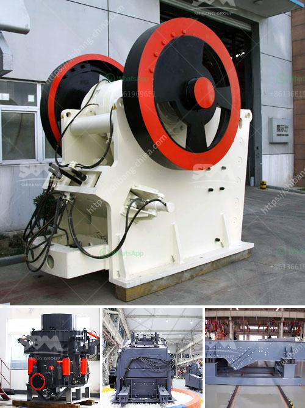

<h3>crusher hydroponic cone crusher</h3>
In today's rapidly evolving agricultural industry, the demand for efficient farming techniques has never been higher. Hydroponics, a soil-less method of cultivating plants, has gained significant popularity due to its numerous advantages over conventional farming. One of the vital tools in a hydroponic system is the crusher hydroponic cone crusher, which plays a crucial role in ensuring the success of this innovative farming method.

The crusher hydroponic cone crusher is a unique piece of machinery specifically designed to break down rock and stone materials into smaller particles. Its primary purpose is to provide the ideal substrate for the plants in a hydroponic system, allowing them to grow and thrive.

One of the key benefits of using a crusher hydroponic cone crusher is its ability to create uniform and consistent-sized particles. Unlike conventional farming methods that rely on soil, hydroponics requires a specific medium to support plant growth. The particles produced by the crusher hydroponic cone crusher are perfectly sized to provide an ideal substrate for root development, nutrient absorption, and overall plant health.

Efficiency is another notable advantage of the crusher hydroponic cone crusher. The equipment is designed to crush materials quickly and efficiently, allowing for a continuous supply of substrate for hydroponic systems. By breaking down large rocks or stones into smaller particles, the crusher hydroponic cone crusher eliminates the need for manual labor, saving significant time and effort.

Additionally, the crusher hydroponic cone crusher is highly versatile and can process a wide range of materials. From limestone to basalt, the machine can handle various types of rocks and stones commonly found in agricultural settings. This versatility ensures that agriculture professionals can obtain the perfect substrate for their hydroponic systems, regardless of the specific plant varieties they cultivate.

Furthermore, the crusher hydroponic cone crusher enhances the overall sustainability of hydroponic farming. By reducing the reliance on traditional soil-based agriculture, hydroponics offers a more eco-friendly alternative. Additionally, the crusher hydroponic cone crusher itself operates with minimal energy consumption, making it an environmentally conscious choice for farmers looking to reduce their carbon footprint.

In conclusion, the crusher hydroponic cone crusher is a game-changer in the agriculture industry, especially for hydroponic farming. Its ability to provide uniform substrate particles, improve efficiency, process various materials, and enhance sustainability makes it an essential tool for modern farmers. As hydroponics continues to gain traction as a viable farming method, the crusher hydroponic cone crusher is poised to play a critical role in revolutionizing agricultural practices worldwide.
<h3>Contact us</h3><ul><li><strong>Whatsapp:&nbsp;<a href="https://wa.me/8613661969651">+8613661969651</a></strong></li><li><a href="https://swt.shibang-china.com/?git&amp;zhl&amp;crusher hydroponic cone crusher"><strong>Online Service(chat now)</strong></a></li></ul><h3>Related</h3><ul><li><a href='ball mill in china.md'>ball mill in china</a></li><li><a href='fine cone crusher.md'>fine cone crusher</a></li><li><a href='large quarry machine manufacturers.md'>large quarry machine manufacturers</a></li><li><a href='dolomite beater mill crusher.md'>dolomite beater mill crusher</a></li><li><a href='aggregates crusher plant for sale in south africa.md'>aggregates crusher plant for sale in south africa</a></li></ul>