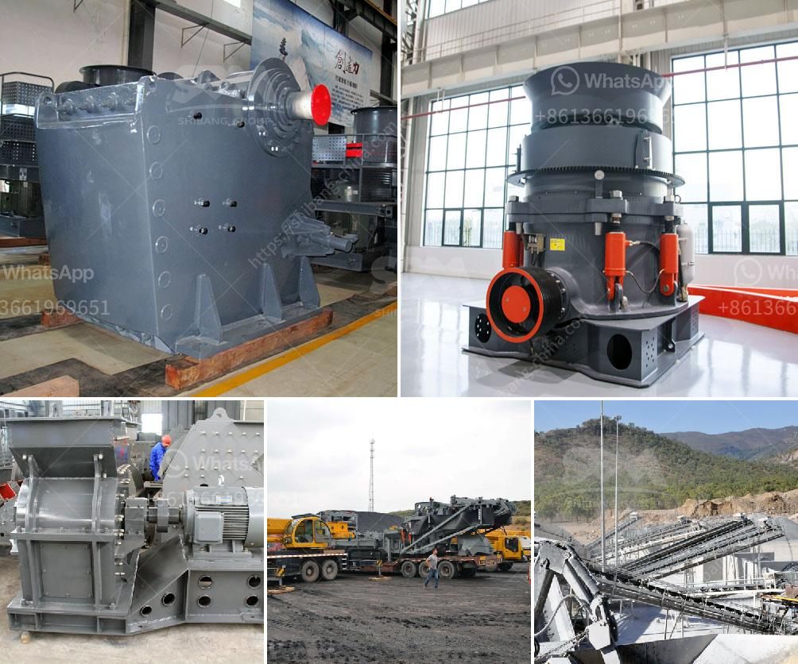

<h3>crusher in coal mining</h3>
Crusher plays an important role in coal mining. It is the main equipment used for crushing and breaking raw coal into small pieces for further processing. Coal crusher is a kind of coal crushing machine commonly used in the process of coal mining. It can crush coal into small pieces (11.06 mm), and can break coal into different sizes (0-25 mm) to meet the requirements of various industrial sectors.

Among the crushers, the most commonly used crushers are jaw crusher, impact crusher, and cone crusher. Jaw crusher is widely used in coal mining. It is mainly used to crush large coal into small pieces for further processing. The coal crusher is a rock crusher suitable for various coal industries, such as mining, cement, coal, metallurgy, building materials, highway, and construction of medium and fine crushing operations.

The impact crusher is mainly used in the coal mining field. It can crush coal into smaller sizes. Therefore, it is more appropriate to use impact crusher. Its crushing principle is to use the principle of impact crushing, which is mainly used in coal, coking, chemical industry, building materials, electricity generation, and other industries with high production capacity and high feed size requirements.

Cone crusher is also widely used in coal mining. The cone crusher working in the mine is divided into three categories: coarse crushing, medium crushing, and fine crushing according to the actual condition of the mine. Cone crushers mainly divide into GP, HP, and Symons series, compound, CS, HPC, sand, laboratory, propel cone, etc.

Crusher in coal mining not only provides raw materials for various coal/mine industries, but also directly enters the energy industry. According to the statistics of the various industrial sectors, coal is the main energy in China, accounting for about 64% of the total primary energy consumption, and the mining industry accounts for about 26% of the total industrial energy consumption. Therefore, efficient and clean production of coal is of great significance.

In addition to the effect of crushing coal, the crusher also has extrusion and bending effects on materials. When the coal mine crusher is working, the coal is squeezed and broken between the two surfaces of the crushing chamber. Under the action of external force, the coal block is ground into coal particles, which improves the combustion properties in the furnace and improves the efficiency of the boiler.

In the process of coal mining, the crusher is also widely used. According to different working principles, it can be divided into vibration crusher, impact crusher, roll crusher, and composite crusher.

Vibration crusher is mainly used for medium and fine crushing operation of crushed coal blocks. It has been widely used in coal preparation plants at home and abroad.

The impact crusher is mainly used for crushing coal in coal mining and processing industries. Simple and compact structure, low power consumption, low noise, stable operation, and reliable performance make it suitable for coal crushing operations in various environments.

The roll crusher is mainly used in coal mining, metallurgy, chemical industry, electric power, building materials, and other industries to crush medium and high hardness materials. It has the characteristics of simple structure, reliable operation, low cost of use, and convenient maintenance.

The composite crusher is a combination of high-yield fine crushing equipment and high-efficiency cone crusher. It has the characteristics of good wear resistance, no clogging, reasonable structure, and convenient maintenance. It is widely used in cement raw material clinker, mine block limestone, coal gangue, and other medium hardness materials.

In conclusion, the crusher plays a crucial role in coal mining and its continuous improvement will promote the development of coal mining industry. It not only provides raw materials for the energy industry but also directly enters various industrial sectors. By improving the efficiency and cleanliness of coal production, it can contribute to the development of a more sustainable and greener energy future.
<h3>Contact us</h3><ul><li><strong>Whatsapp:&nbsp;<a href="https://wa.me/8613661969651">+8613661969651</a></strong></li><li><a href="https://swt.shibang-china.com/?git&amp;zhl&amp;crusher in coal mining"><strong>Online Service(chat now)</strong></a></li></ul><h3>Related</h3><ul><li><a href='cone crusher uae dealer.md'>cone crusher uae dealer</a></li><li><a href='mining crusher for lateric ores cost.md'>mining crusher for lateric ores cost</a></li><li><a href='basalt processing plant.md'>basalt processing plant</a></li><li><a href='cement production process.md'>cement production process</a></li><li><a href='ton hour coal crusher and screen.md'>ton hour coal crusher and screen</a></li></ul>