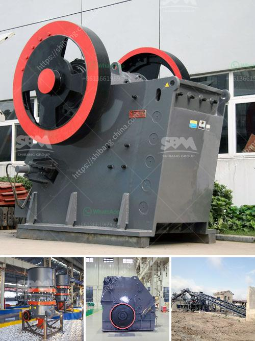

<h3>crusher industrial jaw crusher information</h3>
In the mining and construction industry, it is essential to ensure efficient crushing of materials to maximize productivity and reduce costs. One of the primary crushers used in mines and quarries is the jaw crusher. This robust machine is designed to handle the toughest materials and has gained popularity due to its reliability and high performance.

A jaw crusher consists of a fixed jaw and a moving jaw, with the latter being driven by an eccentric shaft. The size of the opening between the jaws determines the size of the crushed material. The jaws of the crusher are lined with replaceable manganese steel liners, which protect them from wear and tear.

The industrial jaw crusher is ideal for crushing a wide range of materials, including concrete, rocks, and ores. It can be used in various applications, such as mining, quarrying, demolition, and recycling. With its powerful and efficient crushing mechanism, the jaw crusher can produce high-quality aggregates of consistent gradation.

This type of crusher is known for its high reduction ratio, which means it can reduce large-sized rocks into smaller particles efficiently. Additionally, the jaw crusher has a simple design and requires minimal maintenance, making it a cost-effective choice for industries.

Safety is of utmost importance in any industrial setting, and jaw crushers are equipped with safety features to ensure operator protection. These features include a locking mechanism for the toggle plate, which prevents accidental incidents caused by the sudden release of pressure. Additionally, the crusher is also equipped with an emergency stop button, enabling quick shutdown in case of any issues.

In conclusion, the industrial jaw crusher is a reliable and efficient machine designed to crush tough materials with ease. Its simple design, high reduction ratio, and low maintenance requirements make it a popular choice in the mining and construction industry. When operated safely and maintained regularly, the jaw crusher can contribute significantly to improved productivity and reduced expenses.
<h3>Contact us</h3><ul><li><strong>Whatsapp:&nbsp;<a href="https://wa.me/8613661969651">+8613661969651</a></strong></li><li><a href="https://swt.shibang-china.com/?git&amp;zhl&amp;crusher industrial jaw crusher information"><strong>Online Service(chat now)</strong></a></li></ul><h3>Related</h3><ul><li><a href='portable conveyor belts for sale.md'>portable conveyor belts for sale</a></li><li><a href='jaw crusher for sale in saudi.md'>jaw crusher for sale in saudi</a></li><li><a href='quarry crusher manufacturere.md'>quarry crusher manufacturere</a></li><li><a href='coal screening plant.md'>coal screening plant</a></li><li><a href='manufacturer of rotary screen for crushed lime stone.md'>manufacturer of rotary screen for crushed lime stone</a></li></ul>