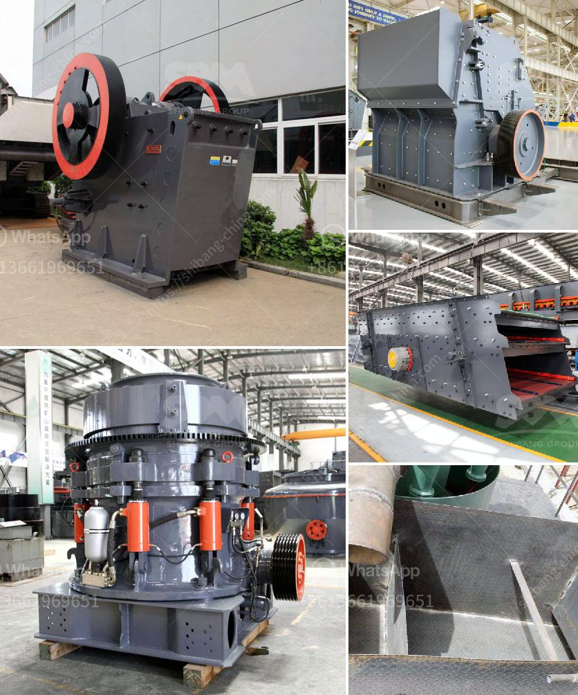

<h3>crusher jaw crusher 6x8 jaw</h3>
Crusher jaw crushers are essential tools that are utilized in the crushing process of various materials, such as granite, concrete, limestone, and many more. These machines are commonly used in mining, road building, construction, and several other industries. One popular variant of the crusher jaw is the 6x8 jaw crusher, known for its durability, efficiency, and versatility.

The 6x8 jaw crusher is a reliable and strong machine that can crush even the hardest materials with ease. Its sturdy construction ensures that it can withstand heavy use and continue to operate efficiently. This jaw crusher is designed to have a large feed opening, allowing it to accept materials of various sizes, reducing the need for pre-sizing.

The 6x8 jaw crusher is equipped with a powerful motor, enabling it to deliver high crushing performance. Its adjustable crushing gap allows the operator to control the size of the finished product, making it suitable for a wide range of applications. Whether you need to crush large rocks into smaller pieces or produce fine aggregates, this machine can do it all.

One of the key features of the 6x8 jaw crusher is its easy maintenance and operation. The machine is designed to be user-friendly, with simple controls and a clear display. Regular maintenance is necessary to keep the crusher in optimal condition and ensure its longevity. However, the maintenance process is straightforward and can be easily performed by trained personnel.

In conclusion, the 6x8 jaw crusher is a reliable and efficient machine that is widely used in various industries. Its durable construction, powerful motor, and adjustable crushing gap make it ideal for crushing a wide range of materials. Whether you're in the construction, mining, or road building industry, this jaw crusher can help you achieve your crushing goals with ease and efficiency.
<h3>Contact us</h3><ul><li><strong>Whatsapp:&nbsp;<a href="https://wa.me/8613661969651">+8613661969651</a></strong></li><li><a href="https://swt.shibang-china.com/?git&amp;zhl&amp;crusher jaw crusher 6x8 jaw"><strong>Online Service(chat now)</strong></a></li></ul><h3>Related</h3><ul><li><a href='stone crusher plants.md'>stone crusher plants</a></li><li><a href='manufacturer of clinker grinding machine.md'>manufacturer of clinker grinding machine</a></li><li><a href='how much do rock crushers cost.md'>how much do rock crushers cost</a></li><li><a href='standard operating procedure for coal pulverizer.md'>standard operating procedure for coal pulverizer</a></li><li><a href='equipment for quarry.md'>equipment for quarry</a></li></ul>