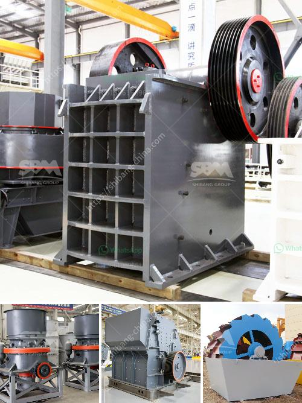

<h3>crusher machine from south korea</h3>
South Korea, officially known as the Republic of Korea, is famous for its efficient and advanced technology. This includes the innovative machinery and equipment they produce, among which, the crusher machine holds a significant position.

A crusher machine is a powerful machine that uses mechanical force to reduce the size of large rocks, solid materials, and so on. This ingenious device is incredibly efficient and can be found in various industries across South Korea, including mining, construction, and recycling.

One of the key features of the crusher machine from South Korea is its ability to crush materials into uniform sizes. This is crucial in industries such as mining, where uniform-sized materials are required for the production process. The crusher machine can handle a wide range of materials, including stones, ores, and minerals, ensuring that industries can extract maximum value from their resources.

Furthermore, South Korean crusher machines are known for their durability and longevity. With regular maintenance and care, these machines can last for many years, providing a cost-effective solution for businesses. This reliability is essential in industries where operational downtime can lead to significant financial losses.

Another advantage of South Korean crusher machines is their versatility. These machines can be used to crush a wide range of materials, from soft to hard rocks, making them suitable for various applications. Additionally, some crusher machines come with specialized attachments, enabling them to process different types of materials.

In recent years, South Korean crusher machines have gained popularity worldwide due to their high-quality standards and technological advancements. Many international companies are importing crusher machines from South Korea to enhance their operational efficiency and productivity.

In conclusion, South Korean crusher machines are renowned for their efficiency, durability, and versatility. With advanced technology and ongoing innovation, these machines continue to contribute significantly to various industries worldwide. As South Korea strives to maintain its position as a global leader in technology, the crusher machine industry remains a significant driving force in its technological advancements.
<h3>Contact us</h3><ul><li><strong>Whatsapp:&nbsp;<a href="https://wa.me/8613661969651">+8613661969651</a></strong></li><li><a href="https://swt.shibang-china.com/?git&amp;zhl&amp;crusher machine from south korea"><strong>Online Service(chat now)</strong></a></li></ul><h3>Related</h3><ul><li><a href='agen jaw crusher kenya.md'>agen jaw crusher kenya</a></li><li><a href='mobile crusher sale germany.md'>mobile crusher sale germany</a></li><li><a href='mining wash plant price.md'>mining wash plant price</a></li><li><a href='plant equipment list for cost estimation.md'>plant equipment list for cost estimation</a></li><li><a href='equipment for crushing gravel.md'>equipment for crushing gravel</a></li></ul>