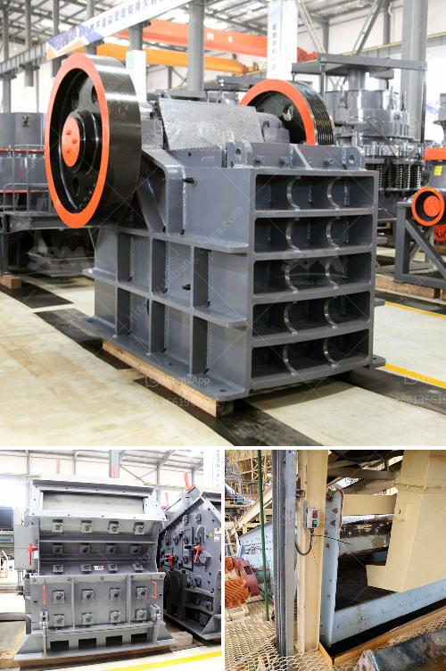

<h3>crusher machine seller</h3>
In today's fast-paced industrialized world, there is a growing demand for efficient and powerful machinery to simplify various tasks. One such machine that has gained immense popularity is the crusher machine. A crusher machine is a powerful tool that is used to reduce the size of various materials such as rock, ore, wood, and concrete.

When it comes to purchasing a crusher machine, it is important to choose a reliable and reputable seller. A good crusher machine seller provides a wide range of machines that are both durable and efficient. They understand the needs of their customers and offer tailored solutions depending on the specific requirements of the task at hand.

One of the advantages of purchasing a crusher machine from a reputable seller is the assurance of quality. These sellers often work with renowned manufacturers who follow strict quality control standards. This ensures that the crusher machines sold are of superior quality, built to withstand heavy usage, and deliver consistent performance.

Additionally, a reputable crusher machine seller offers a comprehensive warranty on their products. This gives the buyer peace of mind knowing that any potential issues with the machine will be promptly addressed. It also reflects the confidence that the seller has in the quality of their products.

Furthermore, a reliable crusher machine seller understands the importance of providing excellent customer service. They have a team of knowledgeable professionals who can guide buyers in selecting the right machine for their specific needs. They also offer after-sales support, such as providing spare parts and technical assistance, to ensure the smooth operation of the machine.

Another factor to consider when choosing a crusher machine seller is their pricing. A reputable seller strives to offer competitive prices without compromising on quality. They understand the value of their customer's investment and aim to provide cost-effective solutions.

Moreover, a good crusher machine seller takes environmental sustainability into consideration. They offer machines that are designed to minimize energy consumption and reduce emissions. By investing in eco-friendly crushing equipment, buyers not only contribute to a healthier environment but also meet regulatory requirements.

In conclusion, when looking to purchase a crusher machine, it is imperative to choose a seller that is reliable, reputable, and customer-oriented. The seller should offer a range of high-quality machines at competitive prices, provide comprehensive warranties, and excellent customer service. By opting for a reputable seller, buyers can be confident in their investment, knowing that they have made the right choice for their crushing needs.
<h3>Contact us</h3><ul><li><strong>Whatsapp:&nbsp;<a href="https://wa.me/8613661969651">+8613661969651</a></strong></li><li><a href="https://swt.shibang-china.com/?git&amp;zhl&amp;crusher machine seller"><strong>Online Service(chat now)</strong></a></li></ul><h3>Related</h3><ul><li><a href='how to start gold mining in ghana.md'>how to start gold mining in ghana</a></li><li><a href='rock crushing companies.md'>rock crushing companies</a></li><li><a href='jual stone crusher mobile cap 30 tph in indonesia.md'>jual stone crusher mobile cap 30 tph in indonesia</a></li><li><a href='rock crusher in philippines.md'>rock crusher in philippines</a></li><li><a href='second hand crusher to buy in zambia.md'>second hand crusher to buy in zambia</a></li></ul>