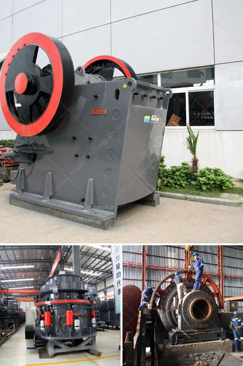

<h3>crusher machine suppliers</h3>
The mining industry is one of the most important sectors in the global economy. It provides valuable resources that are used in various industries, such as construction, manufacturing, and energy. One key equipment that plays a vital role in this industry is the crusher machine.

Crusher machines are used for crushing large rocks, stones, and minerals into smaller pieces or granules for further processing. They are designed to reduce the size of rocks or minerals to make it easier to transport and process. These machines are widely used in mining operations, where the material needs to be broken down into smaller sizes before further processing.

The demand for crusher machines is on the rise due to the increasing growth of the mining industry globally. As mining companies continue to explore and extract valuable resources from the earth, the need for efficient and reliable crushing equipment becomes essential. This is where crusher machine suppliers come into play.

Crusher machine suppliers play a crucial role in the mining industry by providing high-quality crushing equipment that helps in increasing efficiency and productivity. These suppliers offer a wide range of products to cater to the diverse needs of mining operations. They provide crushers of different types, sizes, capacities, and technologies to suit various applications.

One of the key advantages of working with crusher machine suppliers is that they offer expert advice and guidance to their customers. They have a deep understanding of the mining industry and can help mining companies choose the right type of crusher machine for their specific requirements. These suppliers have a vast knowledge of different minerals and rocks and can recommend the most suitable crusher machine for different types of ores.

Furthermore, crusher machine suppliers ensure that their products meet the highest quality standards. They use advanced technology and manufacturing processes to produce durable and robust machines that can withstand the harsh conditions of the mining environment. These suppliers invest in research and development to continuously improve the performance and efficiency of their machines.

Moreover, crusher machine suppliers offer comprehensive after-sales service and support to their customers. They provide installation, maintenance, and repair services to ensure that the machines operate at their optimal levels. This assistance helps mining companies minimize downtime and maximize the productivity of their operations.

In conclusion, crusher machine suppliers play a critical role in the growth of the mining industry. With their high-quality products, expert guidance, and comprehensive support, they contribute to the efficiency and productivity of mining operations. As the demand for valuable resources continues to rise, the need for reliable and efficient crushing equipment becomes crucial. Therefore, it is important for mining companies to partner with reputable crusher machine suppliers to enhance their operations and drive the growth of the mining industry.
<h3>Contact us</h3><ul><li><strong>Whatsapp:&nbsp;<a href="https://wa.me/8613661969651">+8613661969651</a></strong></li><li><a href="https://swt.shibang-china.com/?git&amp;zhl&amp;crusher machine suppliers"><strong>Online Service(chat now)</strong></a></li></ul><h3>Related</h3><ul><li><a href='belt conveyor untuk batubara.md'>belt conveyor untuk batubara</a></li><li><a href='slag grinding process.md'>slag grinding process</a></li><li><a href='diamond mining machinery prices.md'>diamond mining machinery prices</a></li><li><a href='aggregate equipment for sale.md'>aggregate equipment for sale</a></li><li><a href='barite crusher machinery.md'>barite crusher machinery</a></li></ul>