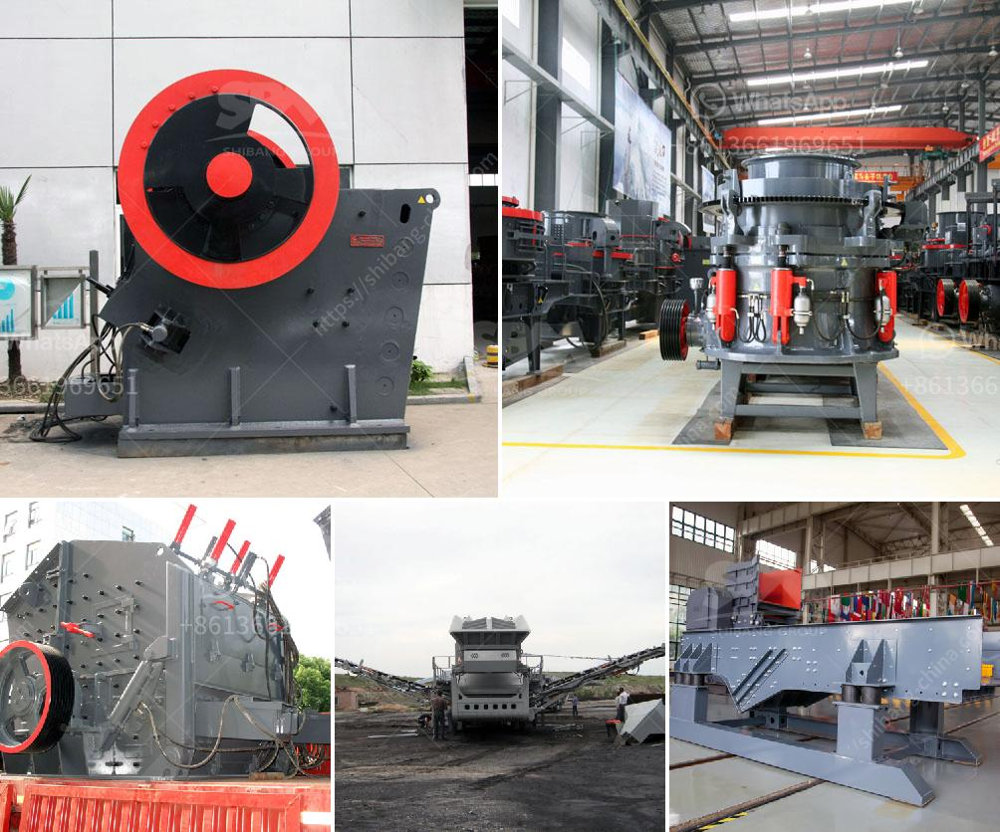

<h3>crusher manufacturer in pakistan in lahore</h3>
In recent years, the country has witnessed an unprecedented growth in the mining and construction sector. This growth has propelled the demand for crushing machinery, necessitating the need for a reliable crusher manufacturer in Pakistan. Lahore is undoubtedly the country's economic hub, where manufacturers and suppliers converge to cater to this ever-growing industry.

One of the leading crusher manufacturers in Lahore is Sandvik Pakistan Pvt. Ltd. This Swedish company has been providing high-quality crushers and other heavy machinery to the Pakistani market for over a decade. With a strong reputation for reliability, efficiency, and durability, Sandvik has become a trusted name in the industry.

Sandvik Pakistan Pvt. Ltd. offers a wide range of crushers, including jaw crushers, impact crushers, cone crushers, and more. These crushers are specifically designed to handle various types of materials, ranging from limestone to iron ore, making them suitable for diverse applications. The company's crushers are known for their exceptional performance, ensuring efficient and effective crushing even in the harshest conditions.

In addition to crushers, Sandvik also provides a range of services to support its customers. These services include installation, maintenance, and repair, ensuring that the crushers operate at their optimal levels throughout their lifecycle. Sandvik's dedicated team of technicians and engineers are available to address any concerns or issues, providing prompt and reliable support.

Another notable crusher manufacturer in Lahore is Atlas Copco Pakistan Pvt. Ltd. With a global presence and a strong foothold in Pakistan, Atlas Copco has established itself as a reliable supplier of premium crushers and other mining equipment. The company's crushers are designed to meet the specific needs of the Pakistani market, providing efficient and reliable performance.

Atlas Copco Pakistan Pvt. Ltd. offers a wide range of crushers, including jaw crushers, cone crushers, and impact crushers. These crushers are renowned for their durability and efficiency, making them ideal for the demanding conditions of the Pakistani mining and construction industry. The company also provides comprehensive after-sales support, ensuring that customers have access to spare parts and technical assistance whenever needed.

Apart from Sandvik and Atlas Copco, several other crusher manufacturers have also set up their operations in Lahore. These manufacturers provide a range of crushers to cater to the diverse needs of the industry. Some of the key players in the market include Metso, Terex, and McCloskey.

Overall, the crusher manufacturing industry in Lahore is thriving, driven by the growing demand for crushers in the mining and construction sector. The presence of reputable manufacturers, such as Sandvik and Atlas Copco, ensures that customers have access to high-quality and dependable crushers. With their exceptional performance and comprehensive support, these manufacturers are playing a crucial role in the development of the industry, contributing to the economic growth of Lahore and the entire country.
<h3>Contact us</h3><ul><li><strong>Whatsapp:&nbsp;<a href="https://wa.me/8613661969651">+8613661969651</a></strong></li><li><a href="https://swt.shibang-china.com/?git&amp;zhl&amp;crusher manufacturer in pakistan in lahore"><strong>Online Service(chat now)</strong></a></li></ul><h3>Related</h3><ul><li><a href='basalt rebar production line.md'>basalt rebar production line</a></li><li><a href='gold rock crusher plant portable.md'>gold rock crusher plant portable</a></li><li><a href='cement stone crusher for sale.md'>cement stone crusher for sale</a></li><li><a href='cost o gypsum processing machines.md'>cost o gypsum processing machines</a></li><li><a href='mobile stone crusher with vibrating screen.md'>mobile stone crusher with vibrating screen</a></li></ul>