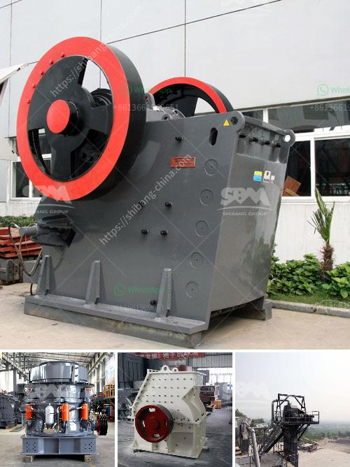

<h3>crusher manufacturers in malaysia</h3>
In recent years, the Malaysian construction industry has seen a boom in infrastructure projects. With an increasing population, the demand for housing and infrastructure projects is on the rise. As a result, the market for crusher equipment has also expanded. Crushing equipment is used to crush stones or rocks into smaller pieces, making them easier to handle and recycle. Malaysia boasts a robust crusher manufacturing industry that plays a crucial role in the construction sector.

One of the major players in the Malaysian crusher manufacturing industry is Striker Crushing. The company offers a variety of models in crushing machines, including impact crushers, cone crushers, and jaw crushers. They have been providing quality construction machinery for the Malaysian market for years and have built a strong reputation for their reliable products.

Another well-known name in the Malaysian crusher manufacturing industry is Trimax Machinery. Their crushers are designed and engineered with the latest technology, ensuring optimal performance and durability. Trimax Machinery offers a range of crushers, including jaw crushers, cone crushers, and impact crushers, catering to various construction needs.

Furthermore, Metso Outotec Malaysia is a leading global crusher manufacturer known for their unparalleled quality and reliability. They provide an extensive range of crusher equipment, including mobile and stationary crushers, for numerous applications. Metso Outotec Malaysia focuses on sustainability and eco-friendly solutions, ensuring that their products are not only efficient but also environmentally responsible.

Besides these major players, there are several other manufacturers in Malaysia that contribute to the crusher market. They offer a wide range of crushers and related equipment, catering to both local and international markets. These manufacturers are constantly innovating and designing new technologies to meet the evolving needs of the construction industry.

The growth of the crusher manufacturing industry in Malaysia can be attributed to the increasing demand for housing and infrastructure projects. As the country continues to develop and urbanize, the need for crushers to process construction materials becomes more significant. Crushers are crucial in breaking down rocks and stones into smaller, more manageable sizes, allowing for easier transportation and recycling.

In addition to meeting local demand, Malaysian crusher manufacturers are also exporting their products to neighboring countries. This positions Malaysia as a key player in the global crusher market. The country's strategic location and well-established manufacturing industry provide an advantage for these manufacturers to expand their reach beyond domestic borders.

However, despite the growth of the crusher manufacturing industry, there are challenges that these manufacturers face. One such challenge is the competition from international manufacturers who offer similar products at competitive prices. Additionally, changing regulations and environmental concerns also require manufacturers to invest in eco-friendly and sustainable technologies.

In conclusion, the crusher manufacturing industry in Malaysia is experiencing significant growth due to the increasing demand for housing and infrastructure projects. Established players like Striker Crushing, Trimax Machinery, and Metso Outotec Malaysia have built a strong reputation for their high-quality products. With their commitment to innovation and sustainability, Malaysian crusher manufacturers are well-positioned to compete in the global market and contribute to the country's economic growth.
<h3>Contact us</h3><ul><li><strong>Whatsapp:&nbsp;<a href="https://wa.me/8613661969651">+8613661969651</a></strong></li><li><a href="https://swt.shibang-china.com/?git&amp;zhl&amp;crusher manufacturers in malaysia"><strong>Online Service(chat now)</strong></a></li></ul><h3>Related</h3><ul><li><a href='hgm micro powder grinding mill.md'>hgm micro powder grinding mill</a></li><li><a href='komatsu crusher for sale in malaysia.md'>komatsu crusher for sale in malaysia</a></li><li><a href='stone crusher capsule.md'>stone crusher capsule</a></li><li><a href='mining characteristics of crusher.md'>mining characteristics of crusher</a></li><li><a href='sand washing machine price.md'>sand washing machine price</a></li></ul>