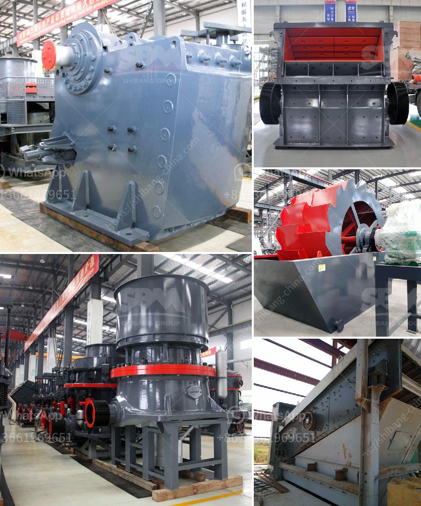

<h3>crusher plant equipment</h3>
Crusher plant equipment is structured with superior equipment for sufficient work under difficult conditions to meet the customer's requirements so that it can be used for any application. The reliability and durability of crusher equipment are very high, more than 95% of equipment failure, entire crusher plant equipment is bearing out, which can make product granularity dedicated.

Crusher plant equipment includes the vibrating feeder, jaw crusher, impact crusher, cone crusher, vibrating screen, belt conveyor, etc. The main working process includes feeding, crushing, screening, and conveying. For maximum efficiency, the screening and conveying system should always be installed in parallel with the crushing system.

Crushing plants can be stationary or mobile to suit individual requirements. AIMIX group is committed to providing tailor-made plant to your specific needs. From the early stage of crusher plant design to engineering and after-sales service, we are always at your side to achieve your goals.

Crushing plant equipment is widely used in many sectors of mining, smelting, building material, highway, railway, water conservancy and chemical industry. Our Stone Crusher Machine is highly demanded and appreciated by clients due to its optimum performance, excellent flexibility, sturdy construction and durability.

Crusher plant equipment is designed according to the nature of the raw materials. The crushing process is usually divided into two or three stages. The primary crushing stage consists of a gyratory crusher that provides a designed high-capacity crushing chamber. Throughput is approximately 8,000 t/h and product size is 90 % smaller than 300 mm. A surge bin below the crusher ensures continuous operation of the plant. The one-button start and stop process allows convenient and fast maintenance.

Uniform material flow in the plant, and high-quality processed products are achieved with the MF screen. This inclined screen is ideal for screening after primary and secondary crushing, as a splitter screen to divide material flow after secondary crushing, and to separate final products in a quarry. With its 2.5m wide screen and its choice of screen decks, it is the perfect solution for contractors looking to produce fine-sized materials such as: topsoil, compost, sand, and aggregates.

The cone crusher is suitable for primary crushing, medium crushing, and fine crushing of hard and medium-hard ores and rocks. It adopts modular design, which simplifies replacement and reduces transportation costs. Whether it is high-hardness materials such as river pebble, granite, basalt, iron ore, or aggregate, the crushing machine will be able to withstand continuous and intense work.

The vibrating screen is used to screen the crushed stone. The belt conveyor is the link equipment that builds the whole crushing plant and used to transport the crushed stone. Quarry equipment. 1. Mining equipment: drilling machine, rock drill, rock grab, tunneling machine, mining shovel, air pick. 2. Crushing equipment: jaw crusher, impact crusher, cone crusher, hammer crushers machine, sand maker machine, and all of them can be made mobile crushing machine.

3. Other equipment: dryers, feeders machine, vibratory screens, grizzly feeder, spiral washing machine, and conveyors. The process involved is to feed the stone in to the jaw crusher or hammer crushers to make it further smaller in size as required by the customer. In the hammer crusher, the stone is crushed. The crushed stone is screened to separate the produce in different sizes by the separator. The crushed stone is conveyed by the belt conveyor to the secondary crusher.

Analyzing the importance of crusher plant equipment, this article concludes that, the choice of equipment should be based on your specific requirements, particle size distribution of the material, production capacity, degree of hardness and abrasive nature of the material, and the desired end product size. It is important to find the right manufacturer for the desired product.
<h3>Contact us</h3><ul><li><strong>Whatsapp:&nbsp;<a href="https://wa.me/8613661969651">+8613661969651</a></strong></li><li><a href="https://swt.shibang-china.com/?git&amp;zhl&amp;crusher plant equipment"><strong>Online Service(chat now)</strong></a></li></ul><h3>Related</h3><ul><li><a href='limestone quarry mining plant price.md'>limestone quarry mining plant price</a></li><li><a href='top crusher manufacturer.md'>top crusher manufacturer</a></li><li><a href='equipment equipment for mineral crushing.md'>equipment equipment for mineral crushing</a></li><li><a href='roller mill machine for mining.md'>roller mill machine for mining</a></li><li><a href='industrial grinder fine powder.md'>industrial grinder fine powder</a></li></ul>