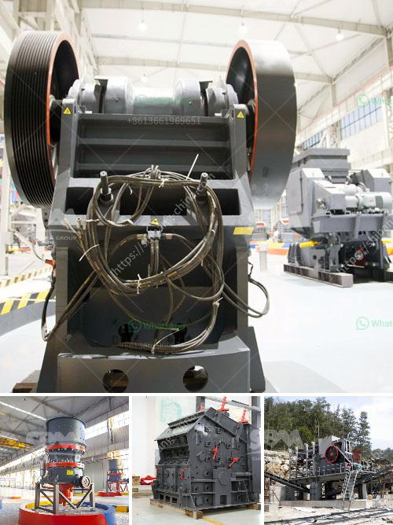

<h3>crusher plant operator in crusher</h3>
Crusher plant operator is a person who is responsible for overseeing the operation of a crusher plant. Typically, under the supervision of a manager, a crusher plant operator operates the crushing circuit, ensuring the smooth operation of the plant by monitoring various operational aspects.

Crusher plants are designed to process rocks and stones obtained from quarries. These rocks and stones are transformed into smaller sizes, in order to be used for construction purposes such as concrete production. The crushing process involves three stages, namely primary crushing, secondary crushing, and tertiary crushing, which all reduce the size of the rocks into smaller and manageable chunks.

The role of a crusher plant operator can be subdivided into two parts, namely, maintenance management and operation management. Maintenance management involves the daily operation and maintenance of the plant equipment to ensure production target adherence. Operation management includes coordinating with the department of transportation, managing stockpile inventory, and ensuring the production process runs smoothly.

One of the key responsibilities of a crusher plant operator is to follow all safety rules and regulations. In the mining and construction industry, safety is a top priority. Therefore, it is essential for the crusher plant operator to operate in a safe and responsible manner, ensuring the safety of both themselves and their colleagues. This may include wearing personal protective equipment (PPE), conducting safety checks, and adhering to safety policies and guidelines.

Additionally, a crusher plant operator must be able to carry out physical tasks and have a good level of physical fitness. The job may require the operator to climb ladders, work in confined spaces, and lift heavy objects. Therefore, being physically capable is crucial for this role.

Furthermore, a crusher plant operator must have excellent communication skills. They need to effectively communicate with other workers and supervisors to ensure smooth operations. Clear communication is also essential during emergencies or when troubleshooting any issues that may arise during the crushing process.

In conclusion, a crusher plant operator plays an important role in the construction and mining industry. As a responsible operator, they must adhere to all safety rules and regulations, follow maintenance schedules, and ensure the smooth operation of the plant. It is a physically demanding job that requires good fitness levels and excellent communication skills. The crusher plant operator is a multi-skilled individual who is capable of handling different tasks at the same time, while maintaining strict adherence to safety and quality standards.
<h3>Contact us</h3><ul><li><strong>Whatsapp:&nbsp;<a href="https://wa.me/8613661969651">+8613661969651</a></strong></li><li><a href="https://swt.shibang-china.com/?git&amp;zhl&amp;crusher plant operator in crusher"><strong>Online Service(chat now)</strong></a></li></ul><h3>Related</h3><ul><li><a href='talc powder importer in europe.md'>talc powder importer in europe</a></li><li><a href='to buy gypsum calcination rotary kiln plant.md'>to buy gypsum calcination rotary kiln plant</a></li><li><a href='mobile crusher discount.md'>mobile crusher discount</a></li><li><a href='rencana anggaran biaya stone crusher.md'>rencana anggaran biaya stone crusher</a></li><li><a href='germany made grinding mill.md'>germany made grinding mill</a></li></ul>