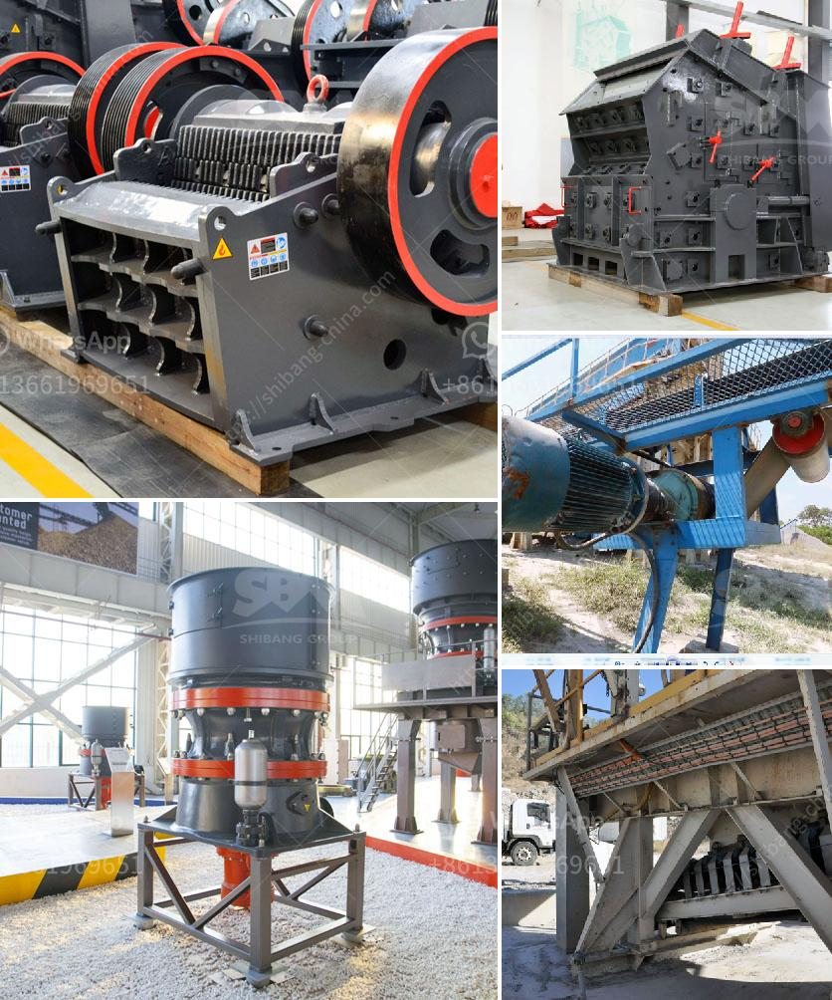

<h3>crusher plant price pakistan</h3>
Crusher plants are widely utilized in the mining and construction industry for crushing different materials such as rocks, marbles, granite, iron ore, and copper ore. However, the availability of these plants highly depends on the location where they are being utilized. In Pakistan, numerous crusher plants are operating to crush stones to facilitate the process of construction. However, these plants have a certain price tag associated with them which needs to be considered before making a purchase.

The price of a crusher plant in Pakistan mainly depends on the type of the machine. The capacity and types of machines vary significantly between large primary jaw crushers and secondary impact crushers. Smaller machines' prices are influenced by affordability and durability while the bigger ones are chosen for their high capacity and efficiency.

In general, a crusher plant price in Pakistan ranges from around $300,000 to $1.5 million. This is primarily due to the fact that the machinery is relatively expensive, and therefore, the investment cost becomes quite high. However, the high cost is offset by the numerous benefits that these plants bring to construction projects.

One of the primary advantages of using a crusher plant is that it reduces the need for manual labor. Previously, construction companies used manual workers to break or crush stones, which not only required a large workforce but also increased the chances of accidents. With the introduction of crusher plants, the need for manual labor has been significantly reduced, leading to cost savings for construction companies.

Another benefit of crusher plants in Pakistan is the quality of crushed stones produced. These plants are equipped with advanced technology that ensures the output of crushed stones is of high quality and meets the required specifications. This is crucial for construction projects as it ensures the durability and strength of structures.

Furthermore, crusher plants also contribute to environmental sustainability. They are equipped with dust collectors and filters that prevent the release of harmful particles and pollutants into the air. This not only protects the health of workers but also helps in maintaining a clean and healthy environment.

When considering the purchase of a crusher plant in Pakistan, it is essential to also take into account the maintenance and operating costs. Regular maintenance is vital for the smooth functioning of the plants and to prevent any costly breakdowns. Operating costs include expenses related to fuel, electricity, and spare parts. It is important to assess these costs and include them in the overall budget to ensure a realistic estimation of the total investment required.

In conclusion, crusher plants play a vital role in the construction industry in Pakistan. The price of these plants may vary depending on their size, capacity, and features. However, the benefits they bring, such as reduced manual labor, high-quality crushed stones, and environmental sustainability, make them a worthwhile investment for construction companies. Therefore, careful consideration should be given to the purchase of crusher plants, including assessing their price and the associated maintenance and operating costs.
<h3>Contact us</h3><ul><li><strong>Whatsapp:&nbsp;<a href="https://wa.me/8613661969651">+8613661969651</a></strong></li><li><a href="https://swt.shibang-china.com/?git&amp;zhl&amp;crusher plant price pakistan"><strong>Online Service(chat now)</strong></a></li></ul><h3>Related</h3><ul><li><a href='coal grinding mill.md'>coal grinding mill</a></li><li><a href='price 200 crusher price.md'>price 200 crusher price</a></li><li><a href='stone crushers baby.md'>stone crushers baby</a></li><li><a href='mobile aggregates washing plant.md'>mobile aggregates washing plant</a></li><li><a href='quarry crusher mine stone.md'>quarry crusher mine stone</a></li></ul>