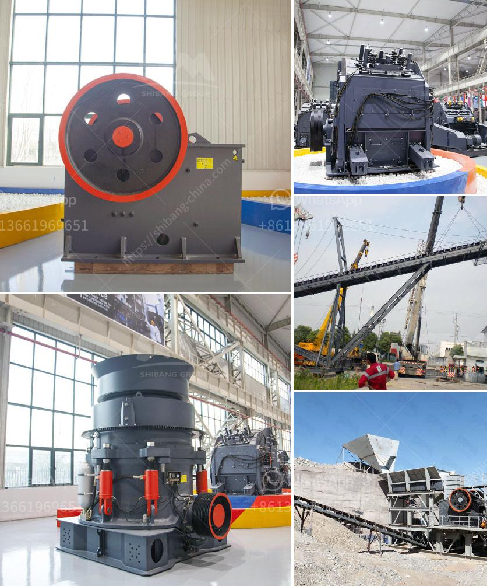

<h3>crusher plant supplier in srilanka</h3>
Crusher plants are widely used in industries such as mining, road construction, metallurgy, building materials, highway, railway, water conservancy, and chemical industries. The crusher plant supplier in Sri Lanka plays an important role in the construction industry and provides sustainable solutions for various industries.

Many customers are looking for a crusher plant supplier in Sri Lanka to provide them with high-quality crushing equipment, which is well received by users. As the leading manufacturer in Sri Lanka, Aimix Machinery believes that we can provide you with a complete set of equipment, including jaw crusher, impact crusher, cone crusher, aggregate crusher plant, sand making machine, mobile crushing plant, etc.

In addition, we can provide specific and customized solutions according to your requirements and site conditions, which greatly reduces your investment cost and improves production efficiency. With more than 30 years of experience in this industry, Aimix has accumulated a wealth of experience and has a group of professional technical personnel to provide you with technical support and comprehensive pre-sales and after-sales services.

1. Transportation convenience: The supplier should have a convenient transportation network, so that the equipment can be delivered to the construction site in time.

2. Reputation: The supplier's reputation in the industry is very important. We should choose a supplier with a good reputation, high customer satisfaction, and positive feedback.

3. Quality of equipment: The supplier should provide high-quality equipment. The crusher plant should be durable, reliable, efficient, and have a long service life.

4. Price: The price of the equipment is also an important factor to consider. We should choose a supplier that can provide cost-effective equipment and ensure the best value for money.

5. After-sales service: After-sales service is also crucial. The supplier should provide comprehensive after-sales service, including installation, commissioning, maintenance, and technical support, to solve problems for customers in a timely manner.

Aimix Machinery is a reliable crusher plant supplier in Sri Lanka with rich experience. Our customers speak highly of our products and services. We have a professional technical team to provide technical support and comprehensive after-sales service. Aimix is committed to providing customers with high-quality products at competitive prices. We have established a good relationship with customers in Sri Lanka and are well received. If you are looking for a crusher plant supplier in Sri Lanka, please feel free to contact us. We will provide you with the best service and solutions!
<h3>Contact us</h3><ul><li><strong>Whatsapp:&nbsp;<a href="https://wa.me/8613661969651">+8613661969651</a></strong></li><li><a href="https://swt.shibang-china.com/?git&amp;zhl&amp;crusher plant supplier in srilanka"><strong>Online Service(chat now)</strong></a></li></ul><h3>Related</h3><ul><li><a href='used mine equipment price.md'>used mine equipment price</a></li><li><a href='jaw crusher grinding.md'>jaw crusher grinding</a></li><li><a href='stone cutting machine in india.md'>stone cutting machine in india</a></li><li><a href='operation hammer mill.md'>operation hammer mill</a></li><li><a href='quartz crushing process.md'>quartz crushing process</a></li></ul>