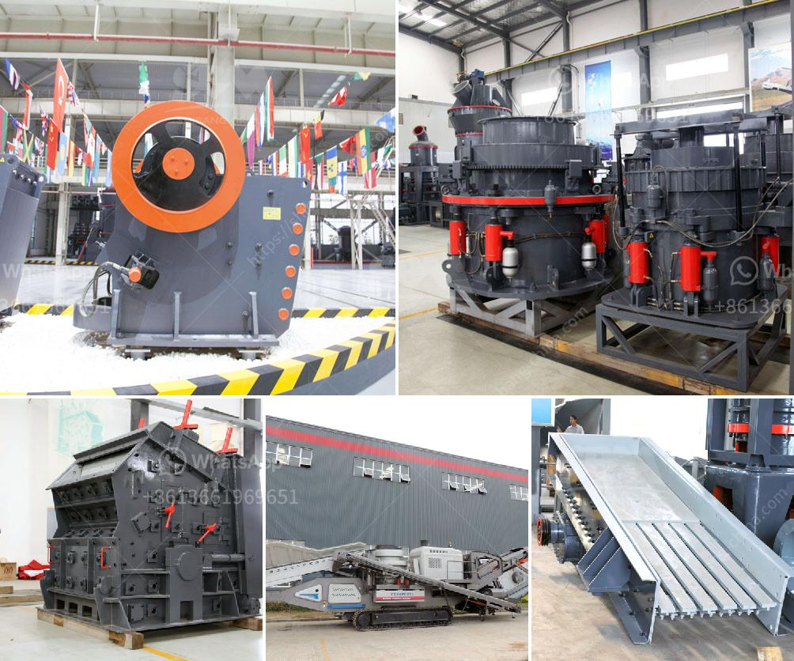

<h3>crusher plant suppliers in saudi arabia</h3>
Saudi Arabia is a Middle Eastern country that is blessed with vast quantities of oil and gas resources. It is the world's leading producer and exporter of oil and gas. Saudi Arabia's economy is heavily dependent on the oil industry, specifically on its upstream sector. The country has recognized the importance of diversifying its economy in recent years and has taken significant steps towards achieving this goal. One of the sectors that it is focusing on is the mining and quarrying industry. 

The mining and quarrying industry in Saudi Arabia is thriving, making it a significant player in the global construction industry. Limestone, marble, gypsum, and granite are just a few examples of the abundant minerals found in the country. Saudi Arabia is also home to more than 40 other minerals. The mining sector alone employs over 300,000 workers, and its contribution to the GDP is around 4%.

To support the mining sector, several crushing and grinding equipment manufacturers are expanding their facilities and establishing their presence in the country. These manufacturers are investing heavily in the development of new technologies and equipment to meet the growing demand for crushing plants in the mining industry. They are also focusing on improving the ecological impact of their equipment by incorporating sustainable practices into their manufacturing processes.

One of the key players in the local market is a renowned crusher plant supplier, Mlindo Machinery. With over a decade of experience in the industry, they are offering the latest technology in crushing plants and other related equipment. Their product range includes jaw crushers, cone crushers, vertical shaft impact crushers, impact crushers, screens, and feeders. Mlindo Machinery ensures that their equipment is durable, reliable, and efficient, ensuring maximum productivity for their customers.

Another leading supplier in the market is ZENITH, a global technology company that specializes in the design, manufacturing, and supply of crushing equipment. ZENITH has a strong presence in Saudi Arabia and has been awarded various contracts for the supply of crushing equipment by various government agencies and private sectors. They have a wide range of crushing plants, including stationary and mobile options, to cater to different requirements of their clients.

Apart from these major players, there are other crusher plant suppliers in Saudi Arabia, including Al-Obaidi Trading Group and Industrial Solutions, both of which have a strong foothold in the mining and quarrying sector. These suppliers offer a wide range of high-quality crushing plants, screens, feeders, and other equipment that are designed to meet the specific needs of their customers.

Saudi Arabia is witnessing a robust growth in the mining and quarrying sector. With the government's focus on diversifying the economy, the demand for crushing plants is set to rise in the coming years. The crusher plant suppliers in Saudi Arabia strive to provide the latest technology and equipment to cater to the growing demands of the mining industry. They are making significant investments in advanced machinery and technological innovations to stay ahead in the competition and meet the ever-increasing market demand.
<h3>Contact us</h3><ul><li><strong>Whatsapp:&nbsp;<a href="https://wa.me/8613661969651">+8613661969651</a></strong></li><li><a href="https://swt.shibang-china.com/?git&amp;zhl&amp;crusher plant suppliers in saudi arabia"><strong>Online Service(chat now)</strong></a></li></ul><h3>Related</h3><ul><li><a href='machinery for manufacturing of artificial granite.md'>machinery for manufacturing of artificial granite</a></li><li><a href='stone crusher aggregate supplier kota.md'>stone crusher aggregate supplier kota</a></li><li><a href='cost of clinker grinding and cemen packing plant.md'>cost of clinker grinding and cemen packing plant</a></li><li><a href='ballast ore crusher for sale in kenya.md'>ballast ore crusher for sale in kenya</a></li><li><a href='safety videos of belt conveyors in hindi.md'>safety videos of belt conveyors in hindi</a></li></ul>