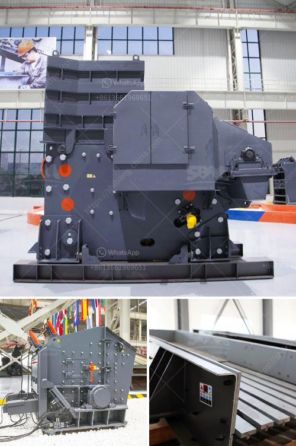

<h3>crusher screening process in dolomite</h3>
The process of crushing and screening enables contractors to size and separate waste material to make a quality product that can be reused or sold, creating a revenue stream for a variety of industries. Crushing and screening systems are commonly used in dolomite processing operations. However, for the processing of dolomite, there are different processes available.

Crushing and screening are the first stages of dolomite processing. This process involves the breaking of the dolomite particles by using a crusher or a screener. The crusher and screener can be applied separately or together in order to improve efficiency.

The quality of crushed dolomite materials is determined by the feed size, which often ranges from 0 to 1000 mm, and the compressive strength, which should not exceed 320 MPa. Additionally, the moisture content of the dolomite material should be less than 8%.

To achieve the desired product size, the crushed dolomite material is screened by a vibrating screen. Crushing and screening equipment often utilize a variety of deck screens with different aperture sizes to classify material into various particle sizes. The screen can be adjusted to provide a specific product size or a range of product sizes, depending on the application.

After the material is crushed and screened, it can be further processed or sold as a finished product. Dolomite products are widely used in various industries such as construction, agriculture, and environmental conservation. For example, crushed dolomite can be used as a base material for roads, as a concrete aggregate, or as a soil conditioner in agricultural applications.

In conclusion, the crushing and screening process in dolomite processing is essential to obtain high-quality products with specific particle sizes. By utilizing various crusher and screening equipment, contractors can efficiently process dolomite materials and generate revenue from the sale of the finished products. The versatility of dolomite products makes them valuable in a wide range of industries, contributing to economic growth and sustainable development.
<h3>Contact us</h3><ul><li><strong>Whatsapp:&nbsp;<a href="https://wa.me/8613661969651">+8613661969651</a></strong></li><li><a href="https://swt.shibang-china.com/?git&amp;zhl&amp;crusher screening process in dolomite"><strong>Online Service(chat now)</strong></a></li></ul><h3>Related</h3><ul><li><a href='sand crusher cost.md'>sand crusher cost</a></li><li><a href='mobile crushers for sale south africa.md'>mobile crushers for sale south africa</a></li><li><a href='ash grinding machine.md'>ash grinding machine</a></li><li><a href='price of gypsum processing plant.md'>price of gypsum processing plant</a></li><li><a href='cone crusher second hand for sale in south africa.md'>cone crusher second hand for sale in south africa</a></li></ul>