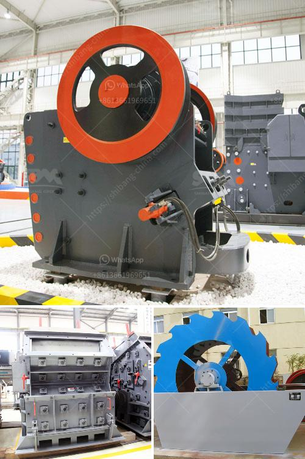

<h3>crusher size reduction ratio</h3>
In the quarrying and mining industry, crushing plays a vital role in extracting valuable minerals and materials from the earth. Whether it is gravel, limestone, or rocks, stone crushing is generally carried out with the help of crushers that are specifically designed to break down large rocks into smaller, more manageable sizes. One crucial aspect of the crushing process is the size reduction ratio, also known as the ratio of the feed size to the desired product size. In this article, we will explore what the size reduction ratio is, why it is important, and how it affects crusher efficiency.

Size reduction ratio refers to the ratio of input size to output size during crushing operations. It can be defined as the ratio of the dimension of the largest stone that can be nipped by the crusher, divided by the distance between the jaws at the opening of the crushing chamber. Generally, the size reduction ratio of a crusher is defined as the average feed size divided by the average product size. The smaller the reduction ratio, the higher the productivity of the crusher.

The size reduction ratio is an essential parameter for many industries, including mining, construction, and recycling. A high reduction ratio allows companies to utilize their resources efficiently, while minimizing costs and maximizing productivity. It enables them to produce a larger quantity of desirable products from a smaller input size, resulting in better overall efficiency.

There are several factors that determine the size reduction ratio of a crusher. These include the type of crusher, the feed size, the crushing configuration, and the desired product size. Different crushers have different size reduction capabilities. For example, jaw crushers have a relatively high reduction ratio, while cone crushers typically have a lower ratio. Impact crushers, on the other hand, can produce a more cubical product and are suitable for crushing softer rocks and materials.

The feed size also plays a crucial role in determining the reduction ratio. When it comes to jaw crushers, the maximum feed size will determine the size of the crusher. For example, a primary jaw crusher with a feed size of 600mm will require a larger crusher than a secondary cone crusher with a feed size of 200mm.

Another important factor to consider is the crushing configuration. Different crushers have different crushing chamber designs, which affect the final product size and shape. For instance, a crusher with a steep crushing chamber and a long crushing stroke will produce a more cubical product, while a crusher with a flatter chamber and a shorter stroke may produce a coarser product.

The desired product size is also critical in determining the reduction ratio. After determining the maximum feed size and the crushing configuration, companies need to consider the size of the desired product. This will help determine the appropriate crusher and crushing chamber needed to achieve the desired size reduction. Some crushers offer adjustable discharge settings, allowing for more control over the final product size.

In conclusion, the size reduction ratio is a crucial factor in the crushing process. It determines the productivity and efficiency of a crusher, as well as the quality and size distribution of the final product. Understanding the significance of the size reduction ratio can help companies select the right crusher and optimize their crushing operations, leading to increased profitability and customer satisfaction.
<h3>Contact us</h3><ul><li><strong>Whatsapp:&nbsp;<a href="https://wa.me/8613661969651">+8613661969651</a></strong></li><li><a href="https://swt.shibang-china.com/?git&amp;zhl&amp;crusher size reduction ratio"><strong>Online Service(chat now)</strong></a></li></ul><h3>Related</h3><ul><li><a href='gypsum powder production line germany.md'>gypsum powder production line germany</a></li><li><a href='iron ore vibrator screen.md'>iron ore vibrator screen</a></li><li><a href='metal crusher suppliers in sri lanka.md'>metal crusher suppliers in sri lanka</a></li><li><a href='quartz plus wet grinder.md'>quartz plus wet grinder</a></li><li><a href='ball mill manufacturers coimbatore.md'>ball mill manufacturers coimbatore</a></li></ul>