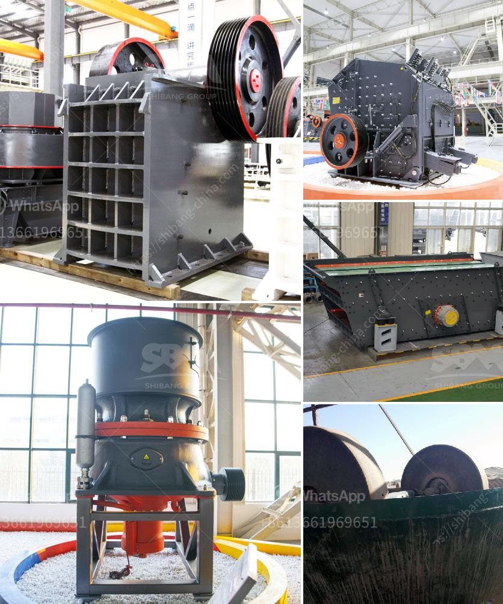

<h3>crushers discarded stone crusher</h3>
In the construction industry, crushers are machines used to break down large stones into smaller pieces for various uses. These machines have made it easier for contractors to dispose of leftover stone materials after a construction project. However, there are instances when crushers themselves become discarded due to various reasons.

A discarded stone crusher is a machine that is no longer in use and is left to rust in an open field or courtyard. Over time, this equipment deteriorates and becomes an eyesore to the surrounding environment. These machines can occupy precious space and pose safety risks if not properly maintained or disposed of.

One of the most common reasons for a stone crusher to be discarded is its outdated technology. As new and improved models are developed, older crushers become less efficient and less profitable to operate. Contractors may choose to invest in newer models that offer higher crushing capacities, reduced maintenance requirements, and better fuel efficiency. Consequently, old crushers are left unused, often bronzed and abandoned.

Another reason for a discarded stone crusher is its mechanical breakdown. Just like any other mechanical device, crushers are subject to wear and tear over time. Components may break or wear out, reducing the crusher's performance and leading to its obsolescence. In such cases, repair costs might exceed the value of the machine itself, making the decision to discard it more cost-effective.

Moreover, as construction trends evolve, the demand for specific types of crushed stones may change. A stone crusher that was once in high demand may become obsolete due to a shift in construction practices or a decline in the demand for certain types of crushed stones. In these cases, a stone crusher may be discarded to free up space for more modern equipment or to align with the new market demands.

Despite being discarded, these stone crushers can still have some potential value. Scrap metal dealers may find interest in them as a source of metal. Components such as gears, crankshafts, or hydraulic systems can be salvaged and reused in other machinery. Additionally, some stone crusher parts can be used as spare parts for similar models, reducing the need for expensive replacements.

To discourage the practice of abandoning stone crushers, governments and environmental organizations have established regulations and guidelines for proper disposal and recycling of these machines. Recycling centers are encouraged to accept discarded crushers and ensure their proper disassembly and disposal. By recycling these machines, valuable resources are recovered, and environmental damage is minimized.

In conclusion, discarded stone crushers are a byproduct of the ever-evolving construction industry. As technology advances and demands change, old crushers are often left unused and abandoned. However, with proper disposal and recycling practices, these machines can still have value, either through salvaging their components or contributing to environmental sustainability. It is crucial for all stakeholders to recognize the importance of responsible waste management and find ways to minimize the long-term impact of discarded stone crushers.
<h3>Contact us</h3><ul><li><strong>Whatsapp:&nbsp;<a href="https://wa.me/8613661969651">+8613661969651</a></strong></li><li><a href="https://swt.shibang-china.com/?git&amp;zhl&amp;crushers discarded stone crusher"><strong>Online Service(chat now)</strong></a></li></ul><h3>Related</h3><ul><li><a href='mobile crushing machines.md'>mobile crushing machines</a></li><li><a href='used classifiers for sale from alpine.md'>used classifiers for sale from alpine</a></li><li><a href='prices of stone crushers in philippines.md'>prices of stone crushers in philippines</a></li><li><a href='limestone grinding machine manufacturers in india.md'>limestone grinding machine manufacturers in india</a></li><li><a href='price of quarry crusher machines.md'>price of quarry crusher machines</a></li></ul>