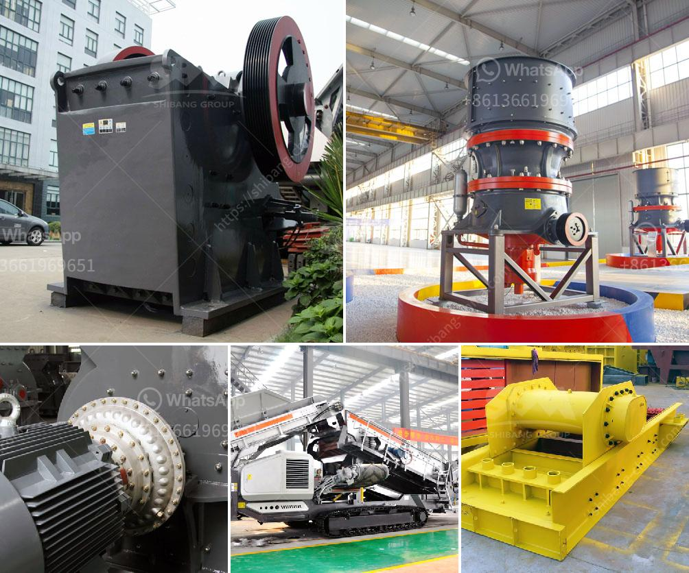

<h3>crushers of cone ethiopia</h3>
Cone crushers are popular rock crushing machines in aggregates production, mining operations, and recycling applications. They are normally used in secondary, tertiary, and quaternary crushing stages. The new generation of cone crushers designed by Ethiopian manufacturers have revolutionized the traditional crushing process, improving efficiency and reducing operation costs.

One of the key features of cone crushers is their ability to crush hard, abrasive rocks with ease. This is particularly beneficial in Ethiopia, where the geology is diverse and the rocks can vary in strength and composition. The powerful cones can crush materials such as granite, basalt, and limestone, providing high-quality aggregates for construction projects.

The Ethiopian cone crushers are equipped with advanced technologies, including automated systems that provide real-time feedback on performance and maintenance needs. This ensures that the machines operate at optimal levels and minimizes the risk of downtime. Additionally, the cone crushers are designed to be easy to maintain, with quick and straightforward access to key components.

In terms of energy efficiency, the Ethiopian cone crushers are designed to consume less power and produce more uniform particles, resulting in lower fuel consumption and reduced carbon emissions. This is an important aspect in a country like Ethiopia, where sustainable development is a priority.

Furthermore, the Ethiopian cone crushers are equipped with safety features that protect both operators and the machines themselves. These include overload protection, hydraulic adjustment, and a variety of safety sensors that detect anomalies and automatically shut down the machines if necessary.

Overall, the cone crushers of Ethiopia have revolutionized the crushing process in the country, offering improved efficiency, reduced operating costs, and enhanced environmental sustainability. With their powerful performance, advanced technologies, and safety features, these machines are undoubtedly a game-changer in the construction and mining industries of Ethiopia.
<h3>Contact us</h3><ul><li><strong>Whatsapp:&nbsp;<a href="https://wa.me/8613661969651">+8613661969651</a></strong></li><li><a href="https://swt.shibang-china.com/?git&amp;zhl&amp;crushers of cone ethiopia"><strong>Online Service(chat now)</strong></a></li></ul><h3>Related</h3><ul><li><a href='stone crushing machines for sale.md'>stone crushing machines for sale</a></li><li><a href='china gold water grinding mills.md'>china gold water grinding mills</a></li><li><a href='kenya jaw crusher for sale.md'>kenya jaw crusher for sale</a></li><li><a href='chrome washing plant for sale.md'>chrome washing plant for sale</a></li><li><a href='cost of clinker grinding and cemen packing plant.md'>cost of clinker grinding and cemen packing plant</a></li></ul>