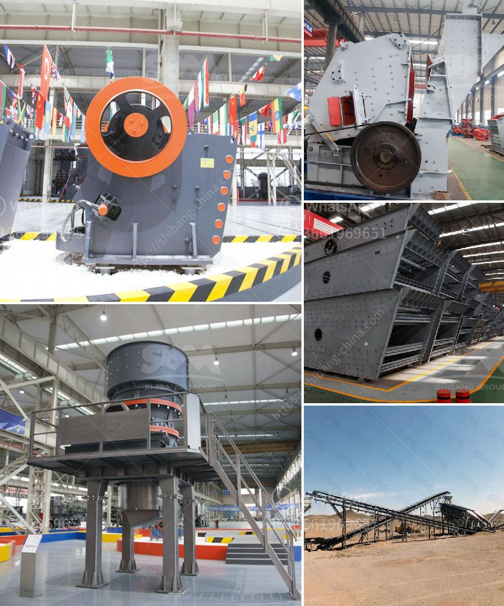

<h3>crushers price in south africa product</h3>
Crushers are industrial machines that are used to crush rocks and reduce their size, in order to facilitate the extraction of valuable minerals. Crushers are incredibly useful for various applications within the mining industry. Crushers can also be used to reduce the size of waste materials, making it easier for disposal or recycling.

One of the most popular crushers in South Africa is the cone crusher. Cone crusher features a unique combination of crusher speed, throw, and cavity design. This combination has proved revolutionary in providing higher capacity and superior product quality in the mining industry.

Cone crushers are ideal for crushing various kinds of mid-hard and above mid-hard ores and rocks. The cone crusher is widely applied in metallurgical, construction, road building, chemical and phosphatic industry. Cone crusher is suitable for hard and mid-hard rocks and ores, such as iron ores, copper ores, limestone, quartz, granite, gritstone, etc.

Cone crushers price is higher than other crushing equipment, but it has high processing capacity. Therefore, this type of quarry machinery for sale is widely used in various fields. Firstly, cone crusher can be applied to metal and non-metallic mineral, cement plant, construction, gravel, metallurgical and other industries. Secondly, cone crusher for sale is used to crush iron ore, nonferrous metal ore, granite, limestone, quartzite, sandstone, pebble and so on. Lastly, trio cone crusher can be used in gravel field, concrete mixing plant, dry mortar, power plant desulfurization and other fields. And this kind of ore crusher for sale is becoming more and more important in many industries.

cone crusher material Cone Crusher Spare Parts: This kind of crusher machine is mainly composed of frame, transmission shaft, eccentric sleeve, spherical bearing, crushing cone, adjusting device, adjusting sleeve, spring and discharging port. In order to give customers a better understanding of the crusher, Aimix will describe the detailed informations of the following parts .

Firstly, the main frame of the rock crushing plant. The main frame consists of the upper frame part and the lower frame part. The two parts are connected by hydraulic cylinder. The upper shelf is a welding piece, and the upper side of the shelf is welded with a wear-resistant copper plate. And the lower frame is a whole cast steel.

Secondly, the rock crushing equipment has large production capacity. The cone crusher has higher speed stroke, so the rated power of the cone crusher is increased, and the processing capacity of the equipment is greatly improved.

Lastly, the hydraulic cone crusher adopts hydraulic adjustment, which greatly simplifies the adjustment of the discharge port. Besides, the hydraulic cone crusher adopts automatic control system to control the discharging opening. Due to its high crushing ratio, high efficiency, low energy consumption, uniform product size, cone crusher machine is usually used for medium crushing and fine crushing.

The cone crushers can crush the hard and medium hard ores and rocks, such as, iron ore, copper ore, limestone, quartz, granite, basalt, diabase. In general, the cone stone crusher Philippines has four different types, ordinary cone crusher, Simmons spring cone crusher, single cylinder hydraulic cone crusher and multi-cylinder hydraulic cone crusher. The main difference between them is the over-iron protection device, discharge adjustment device, transmission device.

To sum up, the price of cone crusher is basically in accordance with the above factors. If you want to know more details, please leave us a message or chat with our on-line service.
<h3>Contact us</h3><ul><li><strong>Whatsapp:&nbsp;<a href="https://wa.me/8613661969651">+8613661969651</a></strong></li><li><a href="https://swt.shibang-china.com/?git&amp;zhl&amp;crushers price in south africa product"><strong>Online Service(chat now)</strong></a></li></ul><h3>Related</h3><ul><li><a href='sand and gravel crusher.md'>sand and gravel crusher</a></li><li><a href='quarry equipment for sale in indonesia.md'>quarry equipment for sale in indonesia</a></li><li><a href='to buy gypsum calcination rotary kiln plant.md'>to buy gypsum calcination rotary kiln plant</a></li><li><a href='specification jaw crusher.md'>specification jaw crusher</a></li><li><a href='smallest cement plant.md'>smallest cement plant</a></li></ul>