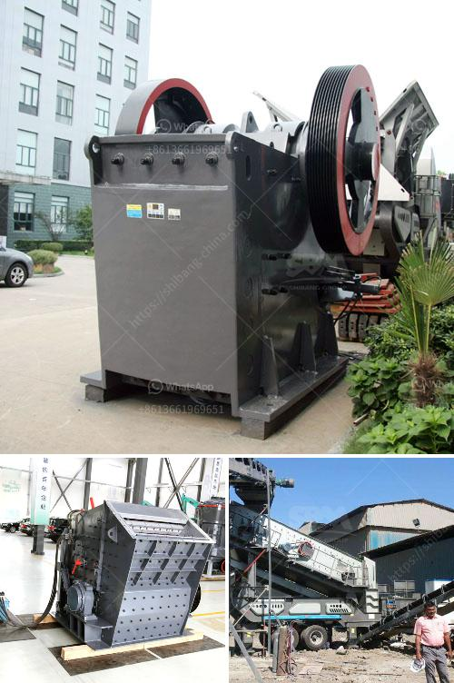

<h3>crushing and screening plant for sale</h3>
Crushing and screening plants are essential in mining and aggregate industries. They are used to break large rocks into smaller pieces, making them easier to transport and process. These plants are available in various types and sizes to suit different project requirements. If you are in need of a crushing and screening plant, here is some information to help you find the right one for sale.

Firstly, it's important to consider the capacity of the plant you require. The capacity reflects the maximum amount of material the plant can handle in a given period. Plants with higher capacities are suitable for large-scale projects, while smaller plants are ideal for smaller operations. The capacity of a crushing and screening plant is usually measured in tonnes per hour (TPH).

Apart from capacity, you should also consider the type of material you will be working with. Different plants are designed to handle specific types of materials such as granite, limestone, or basalt. It is crucial to choose a plant that is optimized for the type of material you will be processing to achieve the best results.

Another important factor to consider is mobility. Some crushing and screening plants are stationary, which means they are set up permanently at a specific location. On the other hand, there are also portable plants that can be easily transported from one site to another. Portable plants are more flexible and suitable for projects that require frequent relocation.

Furthermore, consider the screening capabilities of the plant. The screening process helps separate the different sizes of crushed materials and ensures a uniform product. A well-designed plant should have efficient screening capabilities to minimize waste and increase productivity.

Finally, take into account the manufacturer and the availability of spare parts and technical support. It is essential to choose a reliable and reputable manufacturer that offers quality equipment and excellent customer service. Spare parts availability and technical support are crucial to minimize downtime and ensure the smooth operation of the plant.

In conclusion, when looking for a crushing and screening plant for sale, consider factors such as capacity, material type, mobility, screening capabilities, and manufacturer support. By taking these factors into account, you can find the perfect plant that meets your project requirements and serves you well for years to come.
<h3>Contact us</h3><ul><li><strong>Whatsapp:&nbsp;<a href="https://wa.me/8613661969651">+8613661969651</a></strong></li><li><a href="https://swt.shibang-china.com/?git&amp;zhl&amp;crushing and screening plant for sale"><strong>Online Service(chat now)</strong></a></li></ul><h3>Related</h3><ul><li><a href='mobile crushing and screening manufacturer in india.md'>mobile crushing and screening manufacturer in india</a></li><li><a href='hydraulic css control for jaw crusher.md'>hydraulic css control for jaw crusher</a></li><li><a href='design of gravel screening and washing plant.md'>design of gravel screening and washing plant</a></li><li><a href='nigeria vertical mill machine.md'>nigeria vertical mill machine</a></li><li><a href='grinding machine capacity 1tph stone crusher machine.md'>grinding machine capacity 1tph stone crusher machine</a></li></ul>