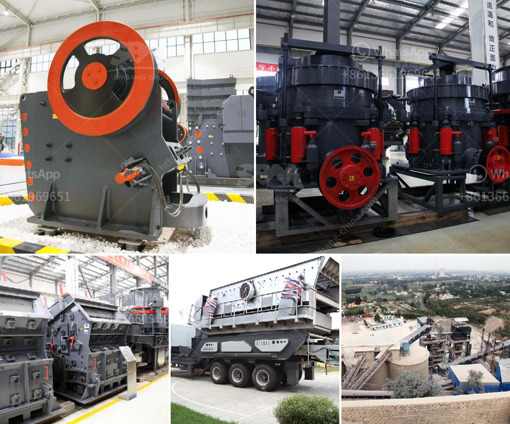

<h3>crushing and screening plant</h3>
Crushing and screening plants play a crucial role in many construction and mining operations. They can be complex pieces of machinery, capable of processing large quantities of material, and providing a valuable asset to the end product.

Crushing and screening plants, whether in a quarry or on a construction site, are vital in ensuring the success of any project. They not only provide the necessary material for the construction or mining project itself but also play a crucial role in the subsequent processing of these materials.

One key aspect of a crushing and screening plant is its efficiency. The plant must be able to process a large variety of materials and produce a range of particle sizes, depending on the specific needs of the project. This requires sophisticated machinery that can handle the volume and size of the incoming material, while also maintaining a high level of accuracy and precision in the final product.

The process of crushing and screening involves the use of various types of machinery, including jaw crushers, cone crushers, and impact crushers. Each of these machines has its specific function, enabling the plant to process the material efficiently and effectively. For example, jaw crushers are commonly used for primary crushing, while cone and impact crushers are often used for secondary and tertiary crushing.

In addition to the crushing machinery, the plant also includes screening equipment, such as vibrating screens and trommel screens. These screens are designed to separate the crushed material into various sizes, allowing for the production of different grades and types of products.

Crushing and screening plants can be configured to produce a variety of products, depending on the specific needs of the project. These may include aggregate for construction purposes, such as concrete and asphalt, or specific grades of sand and gravel. They can also produce material for use in the mining industry, such as coal and ore.

One of the main advantages of using a crushing and screening plant is its mobility. Plants can be easily moved from one location to another, allowing for the efficient processing of materials at different sites. This is particularly beneficial for projects that require the extraction and processing of materials in multiple locations or for temporary construction sites.

Furthermore, crushing and screening plants are designed to be energy-efficient and environmentally friendly. Advanced technologies and features are incorporated into these plants to minimize energy consumption and reduce emissions. This is an important aspect, considering the growing emphasis on sustainability and environmental stewardship in the construction and mining industries.

In conclusion, crushing and screening plants are essential in various construction and mining operations. They provide the necessary material for the project itself, while also playing a crucial role in the subsequent processing of these materials. With their efficient and versatile machinery, these plants ensure the production of high-quality products, while also prioritizing energy efficiency and environmental sustainability. Thus, investing in a crushing and screening plant can be an excellent decision for any construction or mining project.
<h3>Contact us</h3><ul><li><strong>Whatsapp:&nbsp;<a href="https://wa.me/8613661969651">+8613661969651</a></strong></li><li><a href="https://swt.shibang-china.com/?git&amp;zhl&amp;crushing and screening plant"><strong>Online Service(chat now)</strong></a></li></ul><h3>Related</h3><ul><li><a href='quarry crusher price.md'>quarry crusher price</a></li><li><a href='gypsum machine price.md'>gypsum machine price</a></li><li><a href='stone cutting machine in india.md'>stone cutting machine in india</a></li><li><a href='industrial application ball mill.md'>industrial application ball mill</a></li><li><a href='stone crusher mills in mercadolibre.md'>stone crusher mills in mercadolibre</a></li></ul>