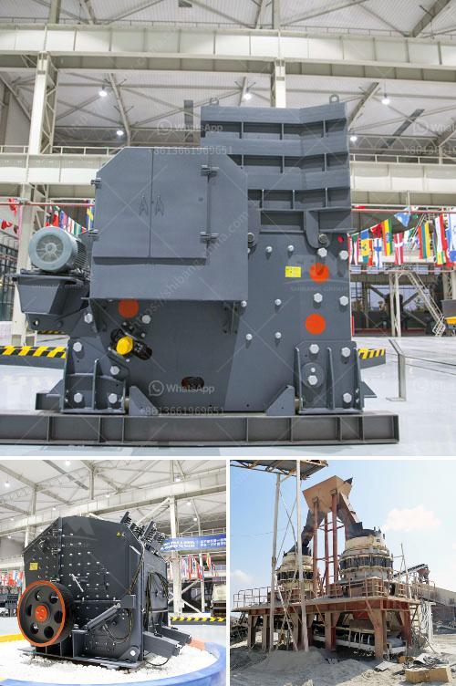

<h3>crushing conveyor belts malaysia</h3>
In today's industrial world, swift transportation and reliable handling of materials are crucial for any business operation to thrive. One such vital component is the conveyor belt, widely used in various industries such as mining, manufacturing, and logistics. However, like any mechanical system, conveyor belts are susceptible to wear and tear, leading to a need for replacement or repair.

In Malaysia, where the industrial sector is flourishing, crushing conveyor belts have proven to be a significant challenge for many businesses. Conveyor belt damage can occur due to several factors, including heavy loads, continuous operation, abrasive materials, and improper maintenance. Such damages can cause a halt in production, leading to significant downtime and financial losses.

The impact of crushing conveyor belts can be seen across industries. In the mining sector, conveyor systems play a vital role in transporting minerals and ores from one location to another. A malfunctioning conveyor belt can lead to disruptions in the production process, impacting the overall productivity and profitability of mining companies.

Similarly, manufacturing plants rely heavily on conveyor belts to optimize material handling and streamline operations. Any damage to the conveyor belt can obstruct the smooth movement of materials, hampering the production schedule, and ultimately affecting the company's bottom line.

The logistics industry is another sector that heavily relies on conveyor belts for efficient and timely delivery of goods. If a conveyor belt breaks down during loading or unloading processes, it can cause delays in the supply chain, leading to dissatisfied customers and potential loss of business.

To address the issue of crushing conveyor belts in Malaysia, businesses must prioritize proactive maintenance practices. Regular inspections and timely addressing of any signs of wear or damage can prevent major disruptions and extend the lifespan of conveyor belts. Furthermore, investing in high-quality, durable conveyor belts can help minimize the risk of crushing and enhance overall operational efficiency.

Additionally, conducting training and providing guidelines for employees on proper conveyor belt usage and maintenance can play a significant role in preventing accidents and reducing conveyor belt damage.

It is crucial for Malaysian businesses to recognize the importance of maintaining operational continuity by addressing the issue of crushing conveyor belts. By taking proactive steps and investing in effective maintenance strategies, companies can ensure a smooth and efficient workflow, ultimately leading to increased productivity and profitability.
<h3>Contact us</h3><ul><li><strong>Whatsapp:&nbsp;<a href="https://wa.me/8613661969651">+8613661969651</a></strong></li><li><a href="https://swt.shibang-china.com/?git&amp;zhl&amp;crushing conveyor belts malaysia"><strong>Online Service(chat now)</strong></a></li></ul><h3>Related</h3><ul><li><a href='price of ball mill in india.md'>price of ball mill in india</a></li><li><a href='ball mill for solutions.md'>ball mill for solutions</a></li><li><a href='mobile crushers for sale in south africa.md'>mobile crushers for sale in south africa</a></li><li><a href='rock quarry equipment for sale in europe.md'>rock quarry equipment for sale in europe</a></li><li><a href='hammer mill machine price.md'>hammer mill machine price</a></li></ul>