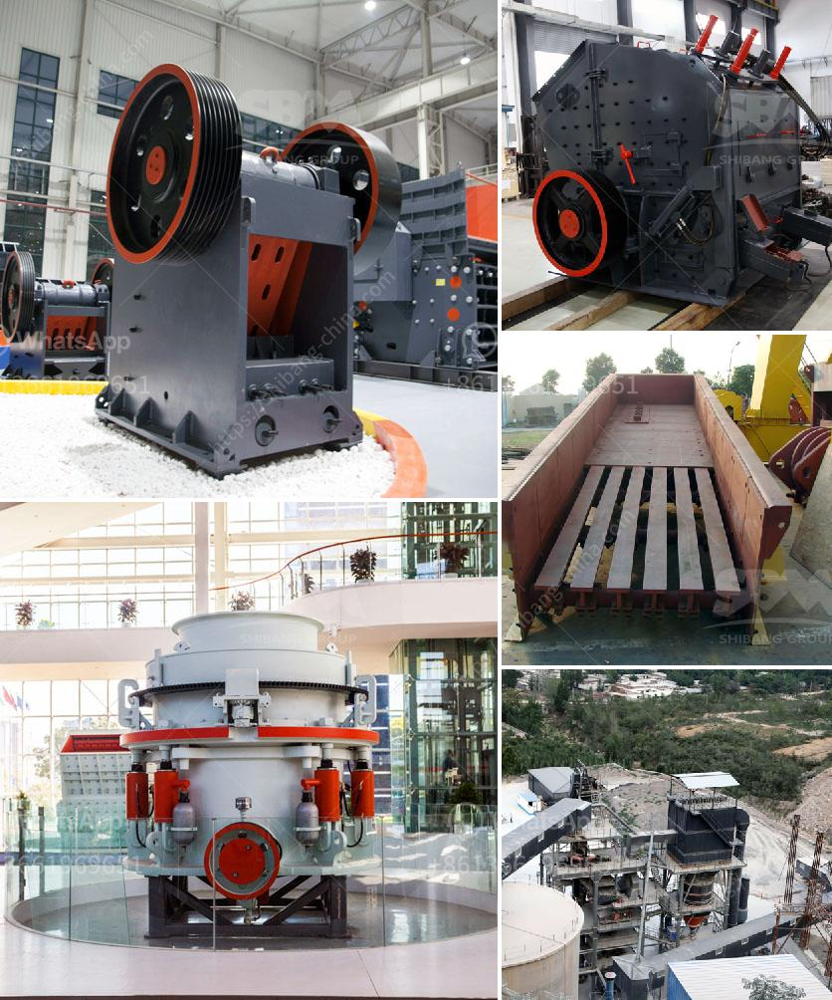

<h3>crushing equipment for rent</h3>
When it comes to construction projects, one challenge that contractors often face is finding the right equipment for the job. With various tasks that require crushing materials, such as concrete, rocks, and asphalt, having the appropriate crushing equipment is essential. Fortunately, renting such equipment has become a popular solution in recent years. Crushing equipment for rent provides contractors with a cost-effective and efficient solution to their on-site crushing needs. If you are looking for crushing equipment for rent, read on to discover why renting might be the best option for you.

Firstly, renting crushing equipment offers flexibility. Construction projects can vary in scale and duration, and having a wide range of equipment options to choose from can help contractors tackle different jobs more effectively. Renting ensures that you have access to the right equipment when you need it, without the burden of long-term ownership costs. It allows you to scale up or down depending on the demands of your project by simply renting additional equipment or returning unnecessary ones.

Secondly, renting crushing equipment saves you money. Purchasing heavy machinery can be a significant investment, especially if it is only needed for a short period. By opting for rental, you can avoid the upfront cost of buying and the additional expenses that come with ownership, such as storage, maintenance, and transportation. Renting also eliminates the need for long-term financing, as you only pay for the equipment when you use it, making it a more cost-effective solution for contractors.

Renting crushing equipment also offers you access to the latest models and technology. Equipment rental companies constantly update their fleets to ensure that their customers have access to the most efficient and advanced machinery. By renting, you can use state-of-the-art crushing equipment that is regularly maintained, ensuring optimal performance and increased productivity on your construction site.

Furthermore, renting crushing equipment reduces downtime. Owning equipment means that you are responsible for its maintenance and repair. When a breakdown or malfunction occurs, it can lead to significant downtime while waiting for repairs or replacement parts. Equipment rental companies have dedicated service teams that can quickly address any issues, minimizing the downtime and ensuring your project progresses on schedule.

Lastly, renting crushing equipment promotes sustainability and environmental consciousness. The construction industry has increasingly recognized the importance of reducing its ecological footprint. Renting equipment reduces waste and carbon emissions associated with manufacturing and disposal. Rental companies adhere to environmental regulations, ensuring that their equipment meets the required emission standards, helping you achieve your sustainability goals.

In conclusion, renting crushing equipment provides contractors with numerous advantages over purchasing. Flexibility, cost-effectiveness, access to the latest technology, reduced downtime, and environmental sustainability are just a few benefits that make renting the ideal solution for your crushing needs. So, the next time you have a construction project that requires crushing, consider renting the equipment. It will not only save you money but will also ensure that you have the right tools at your disposal to complete your project efficiently and successfully.
<h3>Contact us</h3><ul><li><strong>Whatsapp:&nbsp;<a href="https://wa.me/8613661969651">+8613661969651</a></strong></li><li><a href="https://swt.shibang-china.com/?git&amp;zhl&amp;crushing equipment for rent"><strong>Online Service(chat now)</strong></a></li></ul><h3>Related</h3><ul><li><a href='coal mining coal equipment coal mine equipment.md'>coal mining coal equipment coal mine equipment</a></li><li><a href='talc powder importer in europe.md'>talc powder importer in europe</a></li><li><a href='vsi crusher for 100tph output per hour.md'>vsi crusher for 100tph output per hour</a></li><li><a href='quartz crushers price in india.md'>quartz crushers price in india</a></li><li><a href='different types of roller milling.md'>different types of roller milling</a></li></ul>