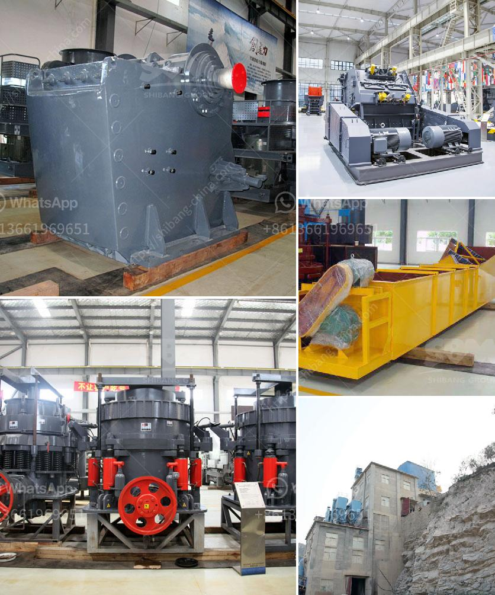

<h3>crushing equipment in south africa</h3>
Crushing equipment in South Africa encompasses all types of crushers utilized to handle various materials, ranging from the traditional jaw crushers and cone crushers to impact crushers, hammer mills, and vertical shaft impact crushers. These types of crushers are extensively used in different fields such as mining, metallurgy, building materials, highways, railways, water conservancy, and chemical industries.

One of the primary reasons why crushing equipment is of utmost importance in South Africa is due to its role in the mining sector. South Africa is rich in mineral resources, and mining plays a significant role in the country's economy. Effective crushing equipment ensures that mining operations can run smoothly and efficiently, extracting valuable minerals with minimal downtime.

In addition to the mining industry, crushing equipment is essential for infrastructure development in South Africa. The construction sector heavily relies on these machines to produce aggregates that are used for making concrete, roads, buildings, and bridges. Without proper crushing equipment, the construction industry would face severe setbacks, affecting the overall infrastructure growth of the country.

Furthermore, the recycling industry in South Africa heavily depends on crushing equipment. Crushing machines are used to break down various materials, including plastic, glass, and even concrete, to facilitate the recycling process. By reducing waste volumes and transforming them into reusable materials, recycling helps in conserving natural resources and reducing landfill space.

To cater to the diverse needs of different industries, manufacturers in South Africa offer a wide range of crushing equipment. These machines are designed to handle various materials with different compressive strengths and sizes, ensuring maximum efficiency and productivity. Additionally, advancements in technology have led to the development of more efficient and environmentally friendly crushing machines, which further contribute to sustainable development practices in the country.

In conclusion, crushing equipment in South Africa is vital for the mining, construction, and recycling industries. Its reliable performance and functionality contribute to the smooth operation of different sectors, promoting economic growth and sustainability. As the demand for minerals, infrastructure, and recycling continues to grow, the need for effective crushing equipment in South Africa will remain paramount.
<h3>Contact us</h3><ul><li><strong>Whatsapp:&nbsp;<a href="https://wa.me/8613661969651">+8613661969651</a></strong></li><li><a href="https://swt.shibang-china.com/?git&amp;zhl&amp;crushing equipment in south africa"><strong>Online Service(chat now)</strong></a></li></ul><h3>Related</h3><ul><li><a href='coal washing machine for sale.md'>coal washing machine for sale</a></li><li><a href='small stone crusher plant in india.md'>small stone crusher plant in india</a></li><li><a href='minerio de maquina de lavar maquina de lavar mineral.md'>minerio de maquina de lavar maquina de lavar mineral</a></li><li><a href='sand washing screening machine.md'>sand washing screening machine</a></li><li><a href='fly ash powder making.md'>fly ash powder making</a></li></ul>