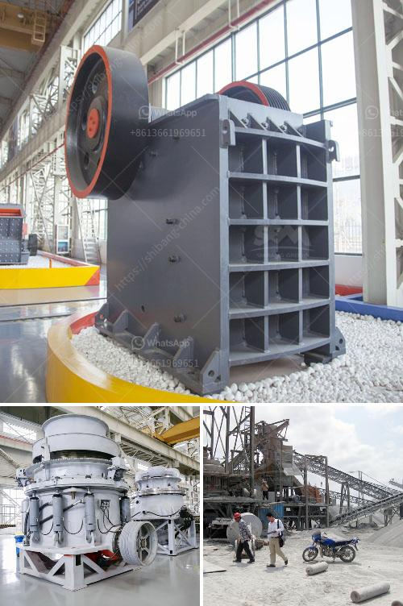

<h3>crushing equipment manufacturers</h3>
When it comes to the construction and mining industries, one crucial aspect that cannot be overlooked is crushing equipment. This equipment plays a significant role in breaking down and reducing the size of large rocks and stones into smaller pieces, making them suitable for various applications.

In this highly competitive market, crushing equipment manufacturers strive to offer innovative and efficient solutions to meet the ever-increasing demands of the industry. These manufacturers specialize in designing and producing high-quality crushing machines that ensure maximum productivity and reliability, even in the harshest conditions.

One of the key factors that set top crushing equipment manufacturers apart is their ability to provide a wide range of machines suitable for different materials and purposes. Whether it is rock, ore, or concrete, these manufacturers offer customized solutions to cater to the specific needs of their customers. From jaw crushers to impact crushers, cone crushers, and even mobile crushing plants, they have it all.

In addition to a diverse product range, leading crushing equipment manufacturers also focus on incorporating advanced technologies into their machines. They constantly innovate and invest in research and development to enhance the performance and efficiency of their equipment. For instance, some manufacturers have integrated intelligent control systems that optimize the crushing process and reduce downtime significantly.

Furthermore, these manufacturers understand the importance of after-sales service and support. They provide comprehensive service packages, including spare parts, maintenance, and training programs to ensure that the customers' investments are protected and their machines are operating at peak performance.

The global crushing equipment market is witnessing steady growth due to the increasing demand from the construction and mining sectors. This has led to intense competition among the manufacturers. However, those who prioritize quality, innovation, and customer satisfaction continue to thrive in this competitive environment.

In conclusion, crushing equipment manufacturers play a vital role in the construction and mining industries. Their commitment to producing high-quality machines, incorporating advanced technologies, and providing excellent after-sales support has made them leaders in the market. As the demand for crushing equipment continues to grow, these manufacturers are poised to meet the industry's needs with their innovative solutions and drive the sector forward.
<h3>Contact us</h3><ul><li><strong>Whatsapp:&nbsp;<a href="https://wa.me/8613661969651">+8613661969651</a></strong></li><li><a href="https://swt.shibang-china.com/?git&amp;zhl&amp;crushing equipment manufacturers"><strong>Online Service(chat now)</strong></a></li></ul><h3>Related</h3><ul><li><a href='marble mining countries.md'>marble mining countries</a></li><li><a href='iron ore vibrator screen.md'>iron ore vibrator screen</a></li><li><a href='buy gold crusher machine.md'>buy gold crusher machine</a></li><li><a href='quarry equipment cost.md'>quarry equipment cost</a></li><li><a href='kenya jaw crusher for sale.md'>kenya jaw crusher for sale</a></li></ul>