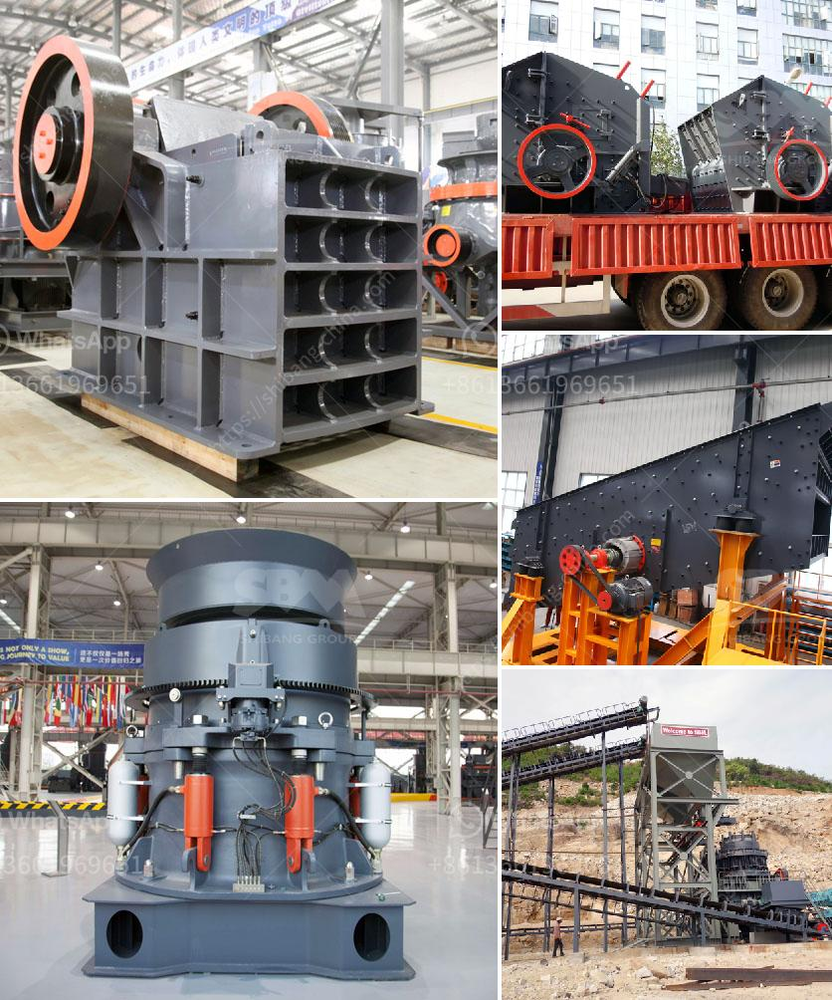

<h3>crushing machine manufacturers china</h3>
China has become a world leader in manufacturing, producing a range of goods and machinery that has transformed industries and markets around the globe. One of the sectors where China has made significant strides is the crushing machine industry. With manufacturers continuously innovating and improving their products, China has become a force to be reckoned with in the global market.

Crushing machines play a crucial role in various industries, from mining and construction to recycling and agriculture. These machines are designed to break down large rocks, stones, and other materials into smaller, more manageable pieces. As demand for such materials continues to grow, the need for efficient and reliable crushing machines becomes paramount.

China’s crushing machine manufacturers have risen to the occasion, providing innovative equipment that meets the needs of various industries. With their expertise and advanced technology, these manufacturers have developed machines that are not only powerful but also environmentally friendly and cost-effective.

One of the key reasons behind China's success in this field is its abundant supply of raw materials. With vast natural resources at their disposal, Chinese manufacturers have access to the materials required to produce high-quality crushing machines. This advantage allows them to keep production costs low while maintaining the quality and durability of their products.

Moreover, China's crushing machine manufacturers have invested heavily in research and development, aiming to create cutting-edge machinery. By constantly improving their technology, these manufacturers have been able to produce machines that are highly efficient, allowing businesses to increase productivity and reduce costs in the long run.

In recent years, environmental considerations have become increasingly important to both manufacturers and consumers alike. Chinese crushing machine manufacturers have recognized this trend and have made significant efforts to develop environmentally friendly equipment. These machines are designed to minimize noise, dust, and emissions, ensuring a safer and cleaner working environment.

Furthermore, China's crushing machine manufacturers have also focused on creating machines that are easy to operate and maintain. This user-friendly approach has attracted customers from all around the world, as businesses seek equipment that requires minimal training and maintenance, ultimately reducing downtime and increasing overall efficiency.

The success of China's crushing machine manufacturers can be seen in their growing market share. Their products are exported to numerous countries, further expanding their presence in the global market. Chinese manufacturers have not only met the demands of their domestic market but have also gained recognition and trust from international customers.

Despite facing intense competition from manufacturers in other countries, China's crushing machine industry continues to thrive. With continuous innovation, high-quality products, and a commitment to meeting customer needs, Chinese manufacturers have positioned themselves as industry leaders.

In conclusion, China's crushing machine manufacturers have played a crucial role in advancing the industry. Through their diligent efforts in research and development, environmental friendliness, and focus on customer satisfaction, they have gained a competitive edge in the global market. As demand for crushing machines continues to rise, China's manufacturers are well-positioned to lead the industry forward.
<h3>Contact us</h3><ul><li><strong>Whatsapp:&nbsp;<a href="https://wa.me/8613661969651">+8613661969651</a></strong></li><li><a href="https://swt.shibang-china.com/?git&amp;zhl&amp;crushing machine manufacturers china"><strong>Online Service(chat now)</strong></a></li></ul><h3>Related</h3><ul><li><a href='prices of stone crushers in philippines.md'>prices of stone crushers in philippines</a></li><li><a href='vibrating screen size decision.md'>vibrating screen size decision</a></li><li><a href='silica grinding machine manufacturer.md'>silica grinding machine manufacturer</a></li><li><a href='dolomite powder plant.md'>dolomite powder plant</a></li><li><a href='machinery for magnesium extracted from dolomite.md'>machinery for magnesium extracted from dolomite</a></li></ul>